# 🗺️ MrSID Viewer Extension — Automation Test Suite

<div align="center">


**End-to-End Automation for the MrSID Viewer Chrome Extension (MV3)**  
*Upload · Process · Metadata · Map · Download — fully validated with CI & dual email reports*

</div>

---

## 📚 Table of Contents

1. [Project Overview](#1-project-overview)
2. [Project Goals](#2-project-goals)
3. [Technology Stack](#3-technology-stack)
4. [High-Level Architecture](#4-high-level-architecture)
5. [Framework Architecture](#5-automation-framework-architecture)
6. [Repository Structure](#6-repository-structure)
7. [Test Execution Lifecycle](#7-test-execution-lifecycle)
8. [Test Data Architecture](#8-test-data-architecture)
9. [Execution Strategy & Validation Categories](#9-execution-strategy--validation-categories)
10. [Test Suite Overview](#10-test-suite-overview)
11. [Ready & Viewport Testcases](#11-ready--viewport-testcases)
12. [Valid Upload & Processing Testcases](#12-valid-upload--processing-testcases)
13. [Invalid / Negative Upload Testcases](#13-invalid--negative-upload-testcases)
14. [Metadata & GIS Map Testcases](#14-metadata--gis-map-testcases)
15. [Multi-file, Drag-Drop & UI Controls](#15-multi-file-drag-drop--ui-controls)
16. [Download TIFF Testcases](#16-download-tiff-testcases)
17. [Large File / Performance Testcases](#17-large-file--performance-testcases)
18. [Security & Empty Map Testcases](#18-security--empty-map-testcases)
19. [Page Object Model](#19-page-object-model)
20. [Fixtures, Utils & Reporting](#20-fixtures-utils--reporting)
21. [Status Model, Warnings & Attachments](#21-status-model-warnings--attachments)
22. [CI/CD Pipeline](#22-cicd-pipeline)
23. [Configuration & Environment](#23-configuration--environment)
24. [Setup & Running Tests](#24-setup--running-tests)
25. [Troubleshooting & Quality Gates](#25-troubleshooting--quality-gates)
26. [Future Enhancements & Summary](#26-future-enhancements--summary)

---

# 1. Project Overview

The **MrSID Viewer Extension Automation Framework** is a Playwright-based E2E suite that validates the **Chrome MV3 MrSID Viewer** extension: install/load, popup UX, raster upload & processing, metadata, Leaflet map rendering, TIFF download, large files, security, and CI stability.

```text
Extension Load
      │
      ▼
Popup Startup Validation
      │
      ▼
File Upload (.sid / .tif / .tiff)
      │
      ▼
Raster Processing (api.geowgs84.com)
      │
      ▼
Metadata + Preview
      │
      ▼
VIEW ON MAP (Leaflet)
      │
      ▼
DOWNLOAD TIFF / CLEAR
      │
      ▼
Reporting (Daily + QA emails)
```

**Release confidence covers:** extension loading, UI behaviour, supported formats, invalid handling, GIS metadata accuracy, map rendering, large datasets, security configuration, and CI/CD stability.

---

# 2. Project Goals

| Goal | What we prove |
| ---- | ------------- |
| **Functional** | Open extension, upload, process, metadata, map, download |
| **Compatibility** | MrSID, GeoTIFF, TIFF, projections, regions, large rasters |
| **Reliability** | No crashes, stable processing, correct error handling |
| **Continuous testing** | GitHub Actions, dual emails, artifacts, release gates |

---

# 3. Technology Stack

| Component | Technology |
| --------- | ---------- |
| Automation | Playwright Test |
| Language | JavaScript (ES modules) |
| Browser | Chromium + unpacked MV3 extension |
| Architecture | Page Object Model (`PopupPage`, `MapPage`) |
| CI/CD | GitHub Actions (8 shards × 1 worker) |
| Reporting | Custom `email-reporter.cjs` + HTML/JSON/JUnit/blob |
| Mail | Nodemailer (SMTP) |
| VCS | Git |

---

# 4. High-Level Architecture

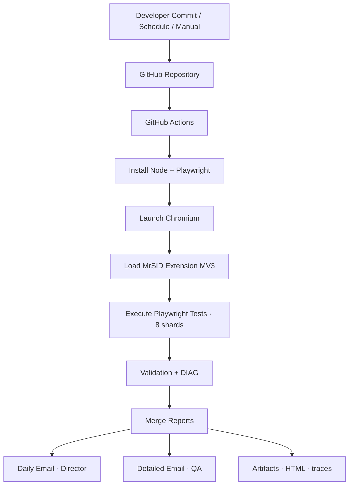

---

# 5. Automation Framework Architecture

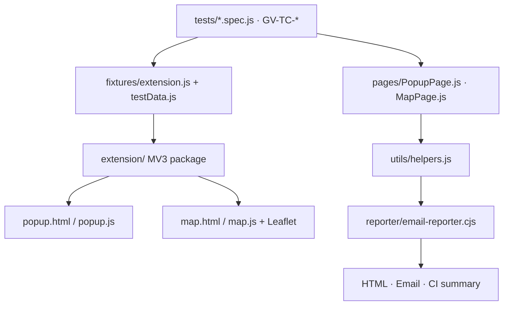

---

# 6. Repository Structure

```text
Mrsid-Extension/
├── extension/                 # MV3 package under test
│   ├── manifest.json
│   ├── popup.html / popup.js
│   ├── map.html / map.js
│   ├── logo / icons / leaflet /
│   └── style.css
├── pages/
│   ├── PopupPage.js           # Upload, process, metadata, download, clear
│   └── MapPage.js             # Empty/malformed storage, raster map
├── fixtures/
│   ├── extension.js           # Load extension + context + DIAG noise filter
│   └── testData.js            # Paths to valid/invalid/large fixtures
├── tests/                     # *.spec.js (GV-TC-* cases)
├── test-data/
│   ├── valid/                 # .sid .tif .tiff multi-file large
│   ├── invalid/               # non-georeferenced / wrong types
│   ├── corrupt/
│   ├── boundary/              # empty, tiny, UPPERCASE names
│   └── gis/                   # regional / projection sets
├── utils/helpers.js           # showStep, logInfo, screenshots, DIAG
├── reporter/
│   ├── email-reporter.cjs     # Daily + detailed emails
│   └── shard-metrics.cjs
├── .github/workflows/playwright.yml
├── playwright.config.js
├── package.json
└── README.md
```

---

# 7. Test Execution Lifecycle

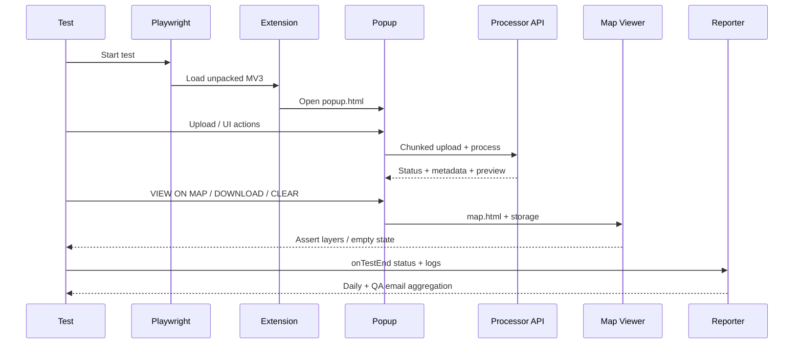

---

# 8. Test Data Architecture

```text
test-data/
├── valid/          01_NAIP_*.sid/.tif, GeoTIFF, multi-file set, UPPERCASE
├── invalid/        non-georeferenced, unsupported types
├── corrupt/        damaged headers
├── boundary/       empty, tiny, special names
├── gis/            hemisphere / projection variants
└── large (via cache/Drive in CI)
                    large_1GB_MrSID.sid
                    large_1.3GB Alaska .sid
                    1.69GB Ireland GeoTIFF
```

Registry: `fixtures/testData.js` (`TestData.validSid`, `large1GB`, …).

---

# 9. Execution Strategy & Validation Categories

```text
Arrange → load extension + open popup
Act     → upload / click / map / download
Assert  → status, metadata, UI, map, downloads
Report  → logs + optional SS/video + emails
```

| Category | Purpose |
| -------- | ------- |
| UI | Popup idle/success chrome |
| Functional | Upload → process → map → download |
| Negative | Reject bad types / empty files |
| GIS | Metadata, bounds, map placement |
| Performance | 1GB–1.69GB rasters |
| Security | Manifest, WAR, no secrets |
| Regression | Full suite on every CI run |

---

# 10. Test Suite Overview

**~55 tests** · project `chromium-extension` · tags `@smoke` `@p0` `@p1` `@p2` `@upload` `@map` `@large-file` `@security`

| Area | Example IDs | Focus |
| ---- | ----------- | ----- |
| Ready / viewport | GV-TC-001-* | Idle UI, accept, logo, layout |
| Valid upload | GV-TC-003-*, 002-01, 010-01, 014-01 | SID/TIF success path |
| Invalid | GV-TC-004-*, 005-04 | Reject / no false success |
| Metadata & map | GV-TC-006-*, 009-*, 008-07 | GIS placement, layers |
| DnD / UI | GV-TC-003-04, 010-02, 008-* | Drop, zoom, multi-file |
| Download | GV-TC-014-03 | Real browser download |
| Large | GV-TC-006-08*, 014-02, 023-02 | GB-scale stability |
| Security / map edge | GV-TC-022-*, 002-01b, 002-02 | Manifest, empty/malformed map |

---

# 11. Ready & Viewport Testcases

### GV-TC-001-01 — Popup opens · System Ready

**Objective:** Idle popup is ready before any upload.

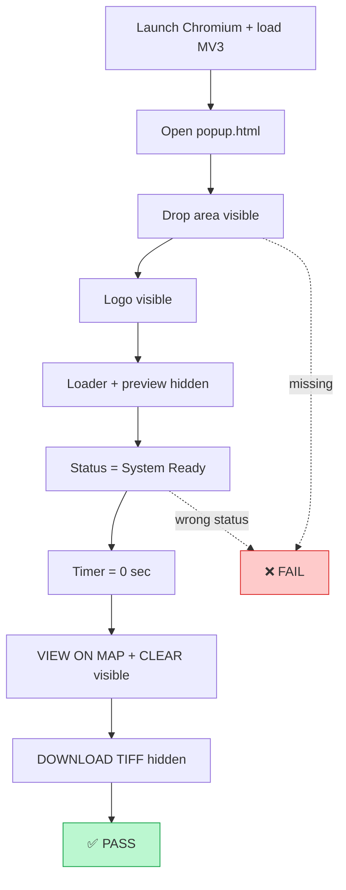

| Check | Criteria |
| ----- | -------- |
| Load | Popup opens, no crash |
| Status | System Ready |
| Timer | Idle **0 sec** |
| Buttons | Map/Clear on; Download off |

**Fails when:** popup crash, missing controls, wrong idle state.

---

### GV-TC-001-02 — File input `accept` lists supported extensions

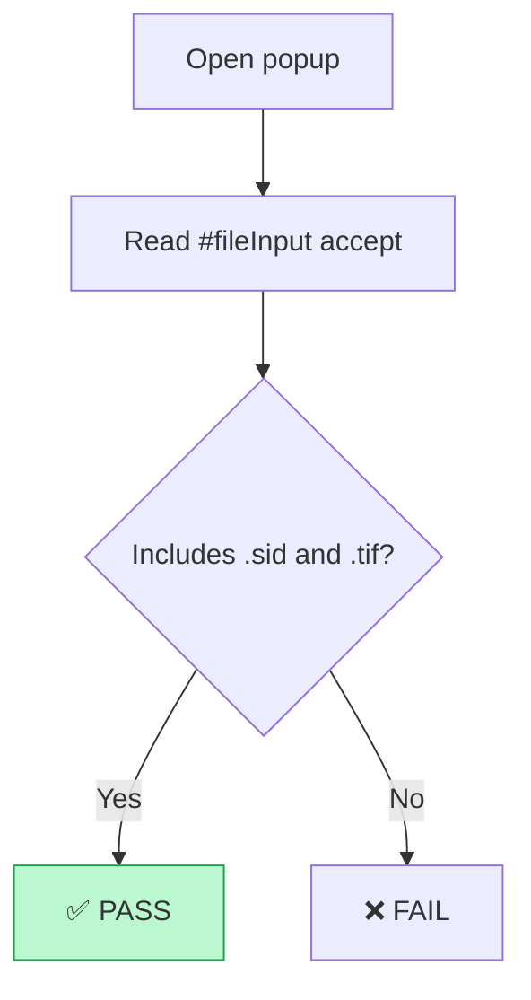

| Check | Criteria |
| ----- | -------- |
| accept | Contains `.sid` and `.tif` (plus packaged types) |

---

### GV-TC-001-03 — No critical console errors on popup load

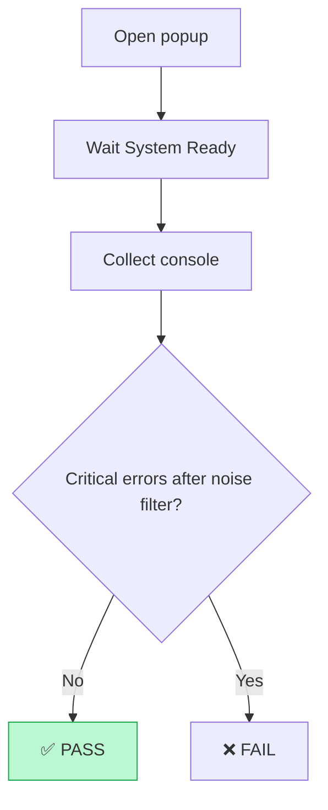

---

### GV-TC-001-04 — Logo static asset renders

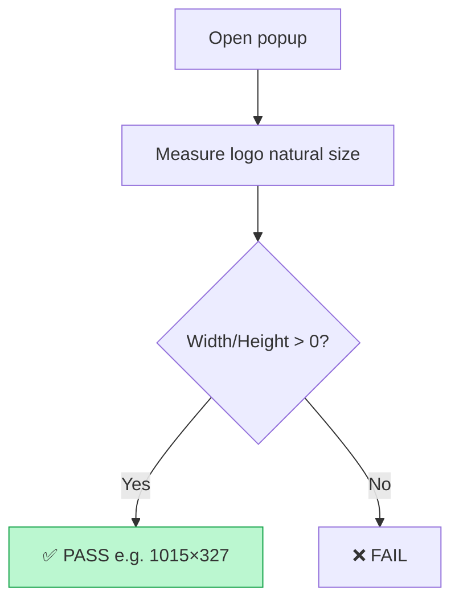

---

### GV-TC-001-05 — Layout at 1920×1080 / 1366×768 / 800×600

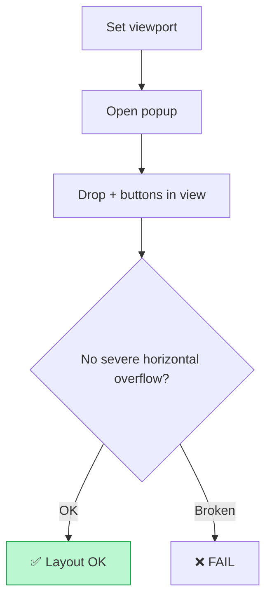

---

# 12. Valid Upload & Processing Testcases

**Shared success pipeline**

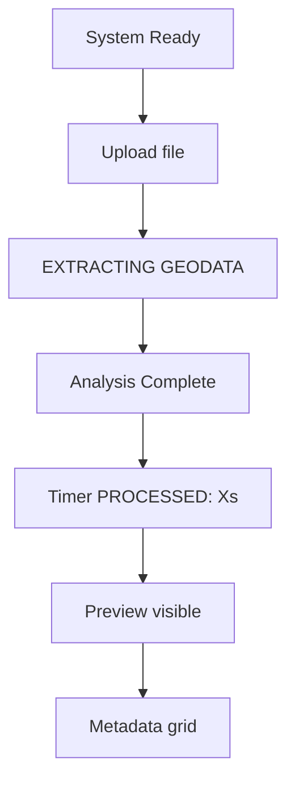

---

### GV-TC-003-01 — Valid .sid → preview + full metadata

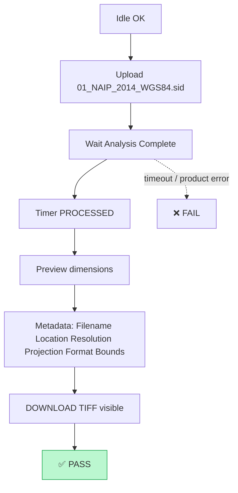

| Criterion | Expected |
| --------- | -------- |
| Status | Analysis Complete |
| Preview | Visible, non-zero size |
| Metadata | Core keys populated |
| TIFF btn | Visible for SID |

---

### GV-TC-003-02 — Valid .tif → preview + full metadata

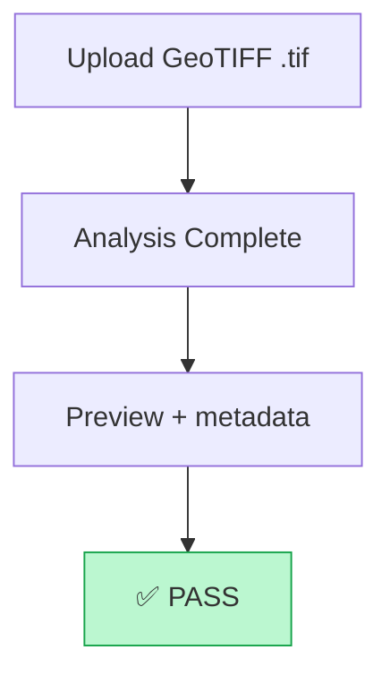

---

### GV-TC-003-03 — Valid .tiff starts processing

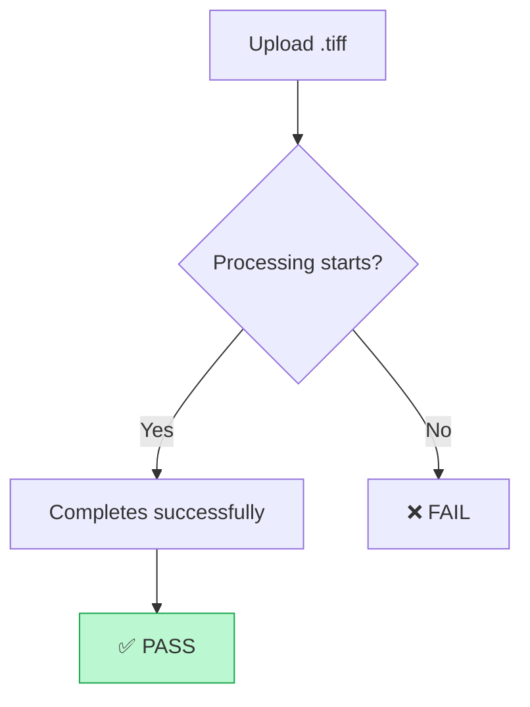

---

### GV-TC-003-05 — UPPERCASE .SID / .TIF accepted

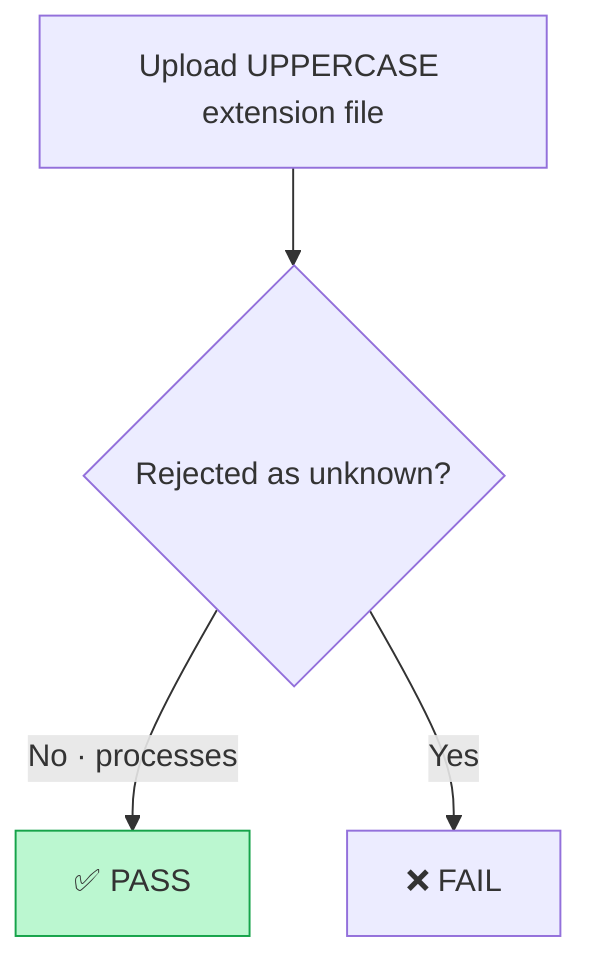

---

### GV-TC-002-01 — VIEW ON MAP renders raster (highlighted)

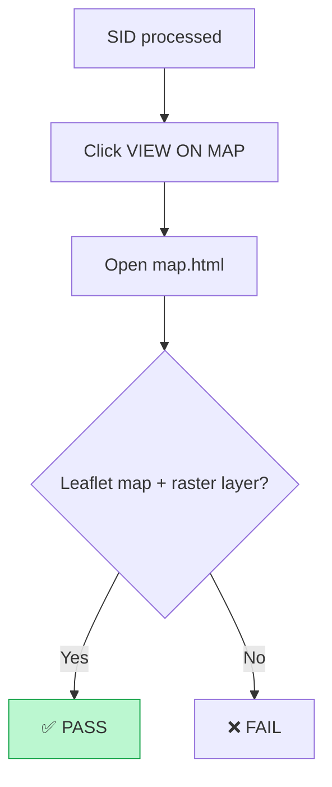

---

### GV-TC-010-01 — Clear after successful upload

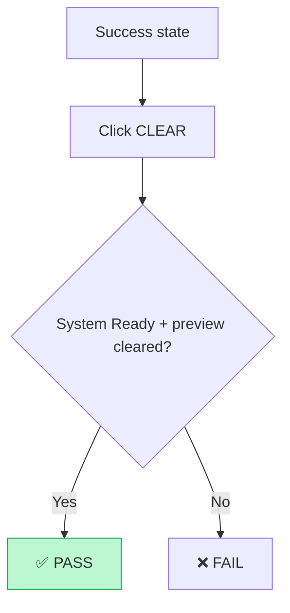

---

### GV-TC-014-01 — DOWNLOAD TIFF visible after valid process

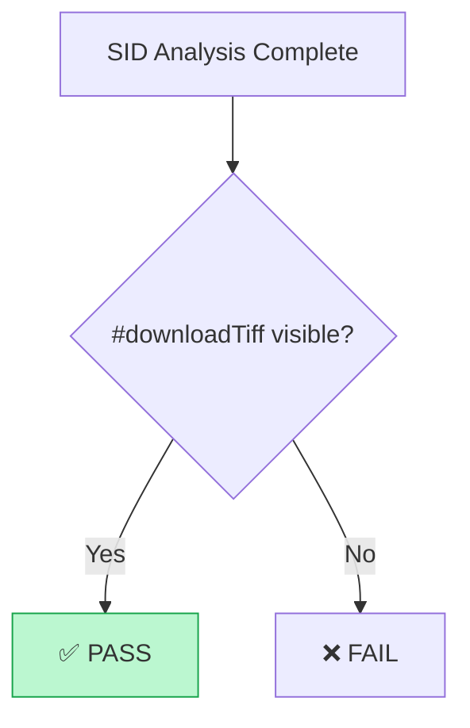

---

# 13. Invalid / Negative Upload Testcases

### GV-TC-004-01 — Unsupported .gif rejected client-side

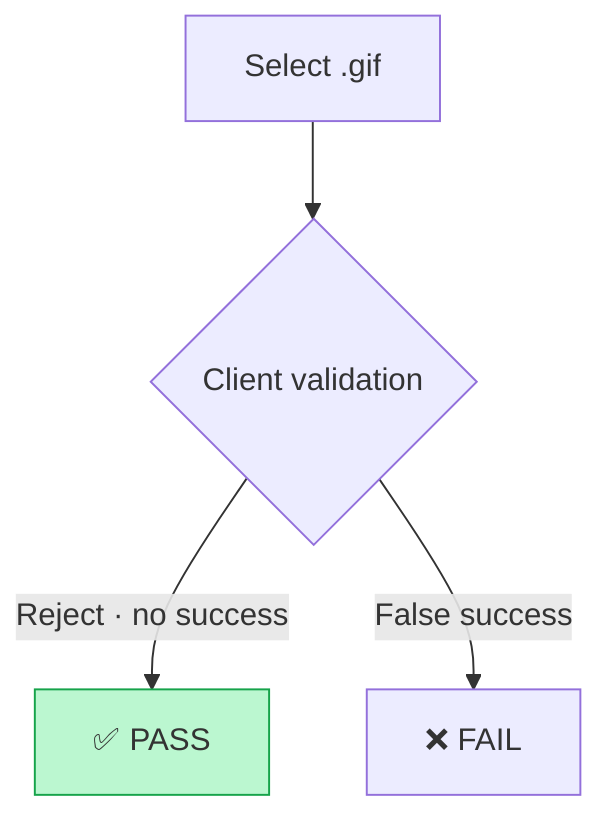

---

### GV-TC-004-01b — .jpg / .png / .pdf rejected

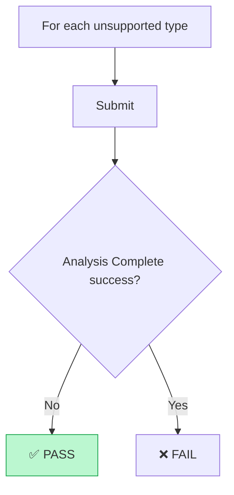

---

### GV-TC-004-02 — Deceptive double-extension rejected

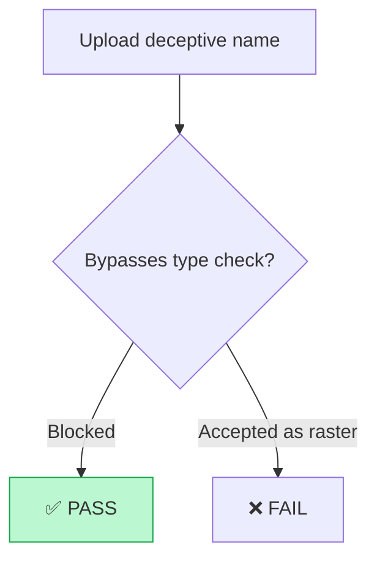

---

### GV-TC-004-03 — No extension rejected

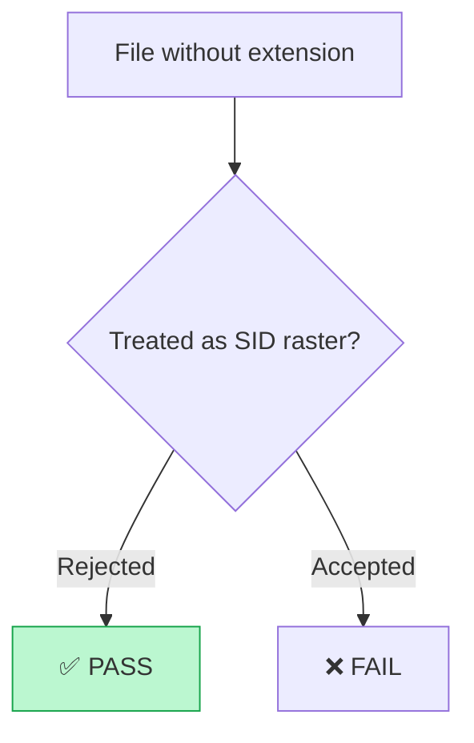

---

### GV-TC-005-04 — Empty / zero-byte does not produce success

```mermaid
flowchart TD
  A[Upload empty file] --> B{Success preview / Analysis Complete?}
  B -->|No| P[✅ PASS]
  B -->|Yes| X[❌ FAIL]

  style P fill:#bbf7d0,stroke:#16a34a
```

**Corrupt / damaged rasters (suite coverage):** detect invalid data, no crash, meaningful non-success path (see `test-data/corrupt`).

---

# 14. Metadata & GIS Map Testcases

### GV-TC-006-* (e.g. 006-01, 006-03, 006-04, 006-05a/b, 006-06, 006-07, 006-07b)

**Objective:** Regional / rotated / projection variants → correct metadata and map placement.

```mermaid
flowchart TD
  A[Upload GIS fixture] --> B[Analysis Complete]
  B --> C[Validate Location / Bounds / Projection]
  C --> D[VIEW ON MAP]
  D --> E{Map stable + layer?}
  E -->|Yes| P[✅ PASS]
  E -->|No| X[❌ FAIL]

  style P fill:#bbf7d0,stroke:#16a34a
```

| Example ID | Focus |
| ---------- | ----- |
| GV-TC-006-04 | SW hemisphere satellite |
| GV-TC-006-07b | Rotated NAIP map placement `@map` |

**Criteria:** Coherent metadata; map does not crash; raster layer when expected.

---

### GV-TC-009-01 … 009-04 — Extra metadata / edge asserts

```mermaid
flowchart TD
  A[Upload tagged fixture] --> B[Process]
  B --> C[Assert specific keys / UI]
  C --> D[Optional map check]
  D --> P[✅ PASS]

  style P fill:#bbf7d0,stroke:#16a34a
```

---

### Hemisphere / boundary GIS intent

Northern/Southern/E-W longitudes and edge coordinates are exercised via GIS fixtures under `test-data` + GV-TC-006/009 family: coordinates → projection → map location → assert.

---

# 15. Multi-file, Drag-Drop & UI Controls

### GV-TC-003-04 — Drag & drop valid .sid

```mermaid
flowchart TD
  A[Idle popup] --> B[Drop .sid on #dropArea]
  B --> C[Analysis Complete]
  C --> D[Preview + metadata]
  D --> P[✅ PASS — same as file input]

  style P fill:#bbf7d0,stroke:#16a34a
```

---

### GV-TC-008-05 / 008-06a / 008-06b / 008-06c — Multi-file progress

```mermaid
flowchart TD
  A[Select multi-file subset] --> B[Observe progress/status]
  B --> C{UI coherent?}
  C -->|Yes| P[✅ PASS]
  C -->|No| X[❌ FAIL]

  style P fill:#bbf7d0,stroke:#16a34a
```

---

### GV-TC-008-07 — Multi-file set + map layers

```mermaid
flowchart TD
  A[Full multi-file set] --> B[All process]
  B --> C[Open map]
  C --> D{Layers / stable?}
  D -->|Fail| R[Retry]
  R --> D
  D -->|Yes| P[✅ PASS · may be PASSED*]
  D -->|No| X[❌ FAIL]

  style P fill:#bbf7d0,stroke:#16a34a
```

---

### GV-TC-010-02 — Zoom controls after preview

```mermaid
flowchart TD
  A[Success preview] --> B[zoomIn visible]
  B --> C[zoomOut visible]
  C --> D[reset present]
  D --> P[✅ PASS]

  style P fill:#bbf7d0,stroke:#16a34a
```

---

### GV-TC-011 / 012 / 013 — Additional UI / status variants

```mermaid
flowchart TD
  A[Drive UI to target state] --> B[Assert control or status]
  B --> C{Matches product?}
  C -->|Yes| P[✅ PASS]
  C -->|No| X[❌ FAIL]

  style P fill:#bbf7d0,stroke:#16a34a
```

---

# 16. Download TIFF Testcases

### GV-TC-014-03 — Click DOWNLOAD TIFF starts download

```mermaid
flowchart TD
  A[SID complete] --> B[Button visible]
  B --> C[Click DOWNLOAD TIFF]
  C --> D{Download event?}
  D -->|Yes · .tif name| P[✅ PASS]
  D -->|No| X[❌ FAIL]

  style P fill:#bbf7d0,stroke:#16a34a
```

| Check | Criteria |
| ----- | -------- |
| Event | Playwright download fired |
| Name | e.g. `01_NAIP_2014_WGS84.tif` |
| Size | Non-zero when file retained |

```mermaid
sequenceDiagram
  participant U as Test
  participant P as Popup
  participant B as Browser
  U->>P: Click DOWNLOAD TIFF
  P->>B: Trigger download
  B-->>U: download event + .tif
```

---

# 17. Large File / Performance Testcases

> Tag `@large-file` · long `PW_PROCESSING_TIMEOUT_MS` · CI retries up to 2 · Drive/cache fixtures

### GV-TC-006-08 — ~1GB MrSID → preview + metadata

```mermaid
flowchart TD
  A[Upload large_1GB_MrSID.sid] --> B[Chunked API upload]
  B --> C{Transient session errors?}
  C -->|Re-init · retry chunks| B
  C -->|Done| D[Analysis Complete]
  D --> E[Preview + metadata]
  E --> P[✅ PASS]

  style P fill:#bbf7d0,stroke:#16a34a
```

**Noise:** “Upload not initialized” / chunk retries are filtered — not Pass+Warn.

---

### GV-TC-006-08b — ~1.3GB Alaska MrSID → preview

```mermaid
flowchart TD
  A[Upload 1.3GB SID] --> B[Complete] --> C[Preview] --> P[✅ PASS]
  style P fill:#bbf7d0,stroke:#16a34a
```

---

### GV-TC-006-08c — ~1.69GB Ireland GeoTIFF → preview

```mermaid
flowchart TD
  A[Upload 1.69GB TIF] --> B[Complete] --> C[Preview] --> P[✅ PASS]
  style P fill:#bbf7d0,stroke:#16a34a
```

---

### GV-TC-014-02 — Large VIEW ON MAP + highlight

```mermaid
flowchart TD
  A[1GB processed] --> B[VIEW ON MAP] --> C[Raster highlight] --> P[✅ PASS]
  style P fill:#bbf7d0,stroke:#16a34a
```

---

### GV-TC-023-02 — Record process time baseline (1GB)

```mermaid
flowchart TD
  A[Upload 1GB] --> B[Measure until complete] --> C[Log baseline] --> P[✅ PASS]
  style P fill:#bbf7d0,stroke:#16a34a
```

**Pass criteria (large):** completes within timeout; browser stable; preview present; no fatal memory errors.

---

# 18. Security & Empty Map Testcases

### GV-TC-022-01 — Manifest permissions minimal (MV3)

```mermaid
flowchart TD
  A[Read manifest.json] --> B{permissions minimal storage?}
  B --> C{host_permissions only API?}
  C -->|Yes| P[✅ PASS]
  B -->|Over-scoped| X[❌ FAIL]

  style P fill:#bbf7d0,stroke:#16a34a
```

---

### GV-TC-022-02 — web_accessible_resources documented

```mermaid
flowchart TD
  A[Read WAR] --> B[Log resources + matches] --> C[Assert expected public assets] --> P[✅ PASS]
  style P fill:#bbf7d0,stroke:#16a34a
```

---

### GV-TC-022-05 — No obvious secrets in package

```mermaid
flowchart TD
  A[Scan packaged files] --> B{API keys / passwords / tokens?}
  B -->|None| P[✅ PASS]
  B -->|Found| X[❌ FAIL]

  style P fill:#bbf7d0,stroke:#16a34a
```

---

### GV-TC-002-01b — map.html empty state without data

```mermaid
flowchart TD
  A[Open map · empty storage] --> B{Crash?}
  B -->|No| C[Empty-state message]
  C --> P[✅ PASS]
  B -->|Yes| X[❌ FAIL]

  style P fill:#bbf7d0,stroke:#16a34a
```

---

### GV-TC-002-02 — Malformed mapDataList does not crash

```mermaid
flowchart TD
  A[Seed not-json] --> B[Seed {}] --> C[Seed []] --> D[Seed broken object]
  D --> E{Any crash?}
  E -->|No| P[✅ PASS]
  E -->|Yes| X[❌ FAIL]

  style P fill:#bbf7d0,stroke:#16a34a
```

---

# 19. Page Object Model

```mermaid
flowchart TD
  Tests --> PopupPage
  Tests --> MapPage
  PopupPage --> ExtensionUI
  MapPage --> LeafletMap
```

**PopupPage:** open, upload/DnD, wait processing, metadata, preview, VIEW ON MAP, DOWNLOAD TIFF, CLEAR, zoom controls.

**MapPage:** open map, empty/malformed storage diagnostics, layer presence.

Tests call page methods — not raw selectors — for maintainability.

---

# 20. Fixtures, Utils & Reporting

| Layer | Role |
| ----- | ---- |
| `fixtures/extension.js` | Chromium + `--load-extension`, extensionId, DIAG noise filter |
| `fixtures/testData.js` | Central fixture paths |
| `utils/helpers.js` | `showStep`, `logInfo` → terminal + shard DIAG (`test-step`), screenshots |
| `reporter/email-reporter.cjs` | Daily + detailed emails, status model, attachments |
| `reporter/shard-metrics.cjs` | Per-shard matrix |

```mermaid
flowchart TD
  Exec[Test execution] --> PW[Playwright result]
  PW --> ER[email-reporter]
  ER --> Daily[DAILY_REPORT_EMAILS]
  ER --> QA[FAILURE_ALERT_EMAILS]
  PW --> HTML[playwright-report]
```

---

# 21. Status Model, Warnings & Attachments

**Priority:** `FAILED` → `SKIPPED` → `PASSED WITH WARNING` → `PASSED`

| Status | Rule |
| ------ | ---- |
| FAILED | Playwright `failed` / `timedOut` |
| SKIPPED | Playwright skipped / skip-logic |
| PASS + WARN | `passed` + **real product** warnings after noise filter |
| PASSED | `passed` + no real warnings (includes retry→pass) |
| PASSED* | QA badge only when `hadRetry` |

**Noise (never Pass+Warn):** upload not initialized, chunk retry, HTTP 400/404, tracing, CDP, target closed, browser-memory heap.

**Attachments**

| Scenario | SS | Video |
| -------- | -- | ----- |
| FAILED | Yes | Yes (≥50KB) |
| Retry recovered | Yes | Yes |
| PASS + WARN | No | No |
| Clean PASSED | No | No |

Director email: counts only. QA email: full START/END step logs.

---

# 22. CI/CD Pipeline

```mermaid
flowchart TD
  A[Push / PR / Cron 07:30 UTC / workflow_dispatch] --> B[🧹 Delete ALL previous completed runs]
  B --> C[📦 Prepare + fixture cache]
  C --> D[🧪 Matrix shards 1–8 · 1 worker each]
  D --> E[📈 Merge blob + matrix + HTML]
  E --> F[📬 Daily summary email]
  E --> G[📬 Detailed QA email]
```

**Stages:** checkout → Node 22 → `npm ci` → Playwright Chromium → sharded `npx playwright test` → merge → email.

**Parallelism:** 8 shards (not random workers sharing one extension context). Large fixtures cached (`FIXTURE_CACHE_VERSION`).

---

# 23. Configuration & Environment

### `playwright.config.js`

| Setting | Value |
| ------- | ----- |
| Project | `chromium-extension` |
| fullyParallel | true (per-test sharding) |
| Retries | 1 on CI (large describe may use 2) |
| Trace | `on-first-retry` |
| Screenshot | `only-on-failure` |
| Video | `retain-on-failure` |

### Environment

```env
SMTP_HOST=smtp.gmail.com
SMTP_PORT=587
SMTP_SECURE=false
SMTP_USER=...
SMTP_PASS=app_password_no_spaces
SMTP_FROM=...
DAILY_REPORT_EMAILS=director@...
FAILURE_ALERT_EMAILS=qa@...,dev@...
ENABLE_EMAIL_REPORTER=true
PW_PROCESSING_TIMEOUT_MS=1800000
```

> Gmail **App Password** required; trim secrets (no trailing newlines).

---

# 24. Setup & Running Tests

```bash
git clone <repo-url> && cd Mrsid-Extension
npm ci
npx playwright install --with-deps chromium

# Full suite
npx playwright test

# Exclude large
npx playwright test --grep-invert @large-file

# Large / security / one case
npx playwright test --grep @large-file
npx playwright test --grep @security
npx playwright test -g "GV-TC-003-01"

# Headed / debug / report
npx playwright test --headed
npx playwright test --debug -g "GV-TC-001-01"
npx playwright show-report
```

**Modes:** Local (headed, debug) vs CI (headless, shards, retries, emails).

---

# 25. Troubleshooting & Quality Gates

| Issue | Checks |
| ----- | ------ |
| Extension does not load | `extension/manifest.json`, path, MV3 service worker |
| Upload failures | Fixture path, API reachability, timeouts |
| Map blank | Processing success, storage payload, Leaflet |
| Large timeout | `PW_PROCESSING_TIMEOUT_MS`, shard logs, retries |
| Email DNS/auth | Trimmed `SMTP_*`, App Password |
| CI ≠ local | Chromium version, missing large fixtures, secrets |

**Artifacts:** `test-results/` (screenshots, videos, traces), `playwright-report/`, blob shards.

**Release quality gates:** startup, upload, processing, GIS/map, security, large-file acceptability, regression suite green (or known waived Pass+Warn only).

```mermaid
flowchart TD
  Build --> Smoke --> Functional --> GIS --> Performance --> Security --> Report --> Decision
```

---

# 26. Future Enhancements & Summary

| Idea | Value |
| ---- | ----- |
| Visual regression | Pixel diffs on popup/map |
| Performance dashboard | Process-time trends (GV-TC-023-02 baseline) |
| Auto defect filing | Jira/GitHub from failures |
| Dockerized runners | Reproducible CI |

### Summary

This framework provides **repeatable E2E coverage** for the MrSID Viewer Extension:

✅ Extension startup & UI  
✅ SID / TIFF / GeoTIFF processing  
✅ Metadata & GIS map rendering  
✅ Negative & security checks  
✅ Large dataset stability  
✅ Dual email reporting & 8-shard CI  

Every **GV-TC** above includes **workflow diagram**, **what is checked**, and **pass/fail criteria**.

---

<div align="center">

**🌍 GeoWGS84 · MrSID Viewer Extension QA**

`Playwright E2E · MV3 · Leaflet · Dual Emails · Sharded CI`

</div>
