# 🗺️ MrSID Viewer Extension — Automation Test Suite

<div align="center">


**End-to-End Automation for the MrSID Viewer Chrome Extension (MV3)**  
*Upload · Process · Metadata · Map · Download — every release validated*

</div>

---

## Table of Contents

1. [Project Overview](#1-project-overview)
2. [Project Goals](#2-project-goals)
3. [Technology Stack](#3-technology-stack)
4. [High-Level Architecture](#4-high-level-architecture)
5. [Framework Architecture](#5-automation-framework-architecture)
6. [Repository Structure](#6-repository-structure)
7. [Test Execution Lifecycle](#7-test-execution-lifecycle)
8. [Test Data Architecture](#8-test-data-architecture)
9. [Execution Strategy & Validation Categories](#9-execution-strategy--validation-categories)
10. [Test Suite Overview](#10-test-suite-overview)
11. [Per-Testcase Workflows](#11-per-testcase-workflows) ← diagrams, checks, criteria for every GV-TC
12. [Page Object Model](#12-page-object-model)
13. [Fixtures & Utilities](#13-fixtures--utilities)
14. [Reporting & Status Model](#14-reporting--status-model)
15. [CI/CD Pipeline](#15-cicd-pipeline)
16. [Configuration & Environment](#16-configuration--environment)
17. [Setup & Running Tests](#17-setup--running-tests)
18. [Troubleshooting](#18-troubleshooting)
19. [Quality Gates & Release](#19-quality-gates--release)
20. [Future Enhancements](#20-future-enhancements)

---

# 1. Project Overview

The **MrSID Viewer Extension Automation Framework** is an end-to-end Playwright suite that validates functionality, reliability, GIS correctness, performance, and security of the **MrSID Viewer Chrome Extension (MV3)**.

```text
Extension load
    → Popup ready
    → File upload (.sid / .tif / .tiff)
    → Raster processing (api.geowgs84.com)
    → Metadata + preview
    → VIEW ON MAP (Leaflet)
    → DOWNLOAD TIFF
    → Clear / negative / large / security paths
    → Dual email reports
```

**Release confidence** comes from automated checks on:

| Area | Examples |
| ---- | -------- |
| Extension loading | MV3 load, popup open, System Ready |
| UI behaviour | Idle chrome, viewport, zoom, clear |
| Supported rasters | SID, GeoTIFF, TIFF, uppercase extensions |
| Invalid handling | gif/jpg/pdf, empty, double-extension |
| GIS metadata | Location, bounds, projection, resolution |
| Map rendering | Leaflet layer, empty/malformed storage |
| Large datasets | ~1GB–1.69GB fixtures |
| Security | Manifest permissions, WAR, no secrets |
| CI stability | 8 shards, retries, noise-free status |

---

# 2. Project Goals

### Functional
Open extension → upload → process → metadata → map → download TIFF → clear.

### Compatibility
MrSID, GeoTIFF, TIFF, large rasters, multiple projections/regions, uppercase extensions.

### Reliability
No crashes, no critical JS failures, stable processing, correct error handling on bad input.

### Continuous testing
GitHub Actions: scheduled + push/PR, shard matrix, daily director email, detailed QA email with logs/media on fail/retry.

---

# 3. Technology Stack

| Component | Technology |
| --------- | ---------- |
| Automation | Playwright Test |
| Language | JavaScript (ES modules) |
| Browser | Chromium + unpacked MV3 extension |
| Extension APIs | Chrome extension test context |
| CI/CD | GitHub Actions (8 shards) |
| Reporting | Custom `email-reporter.cjs` + HTML/JUnit/blob |
| Architecture | Page Object Model + fixtures |
| Mail | Nodemailer (SMTP) |

---

# 4. High-Level Architecture

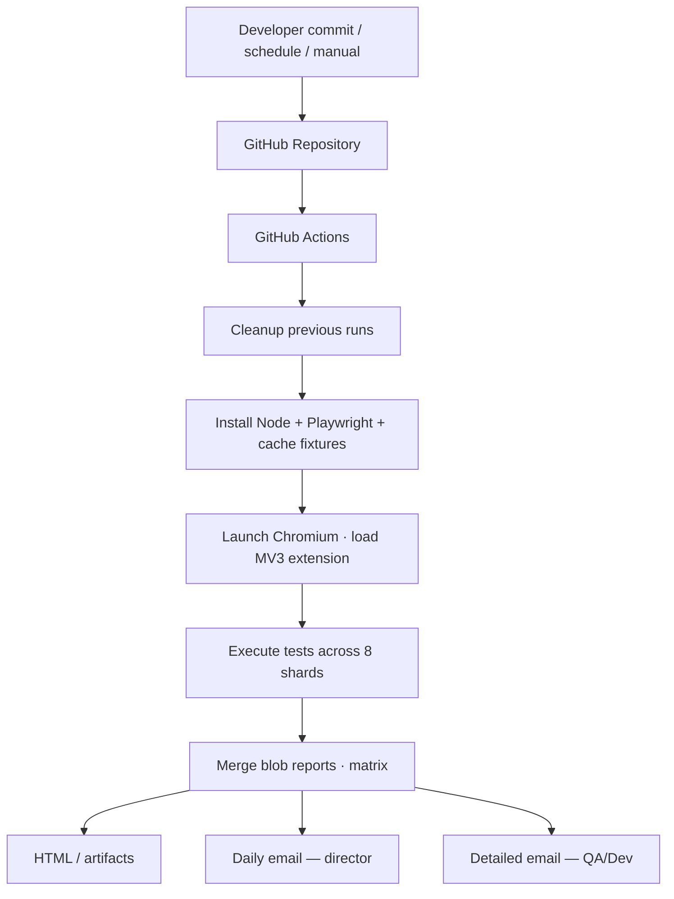
```mermaid
flowchart TD
  A[Developer commit / schedule / manual] --> B[GitHub Repository]
  B --> C[GitHub Actions]
  C --> D[Cleanup previous runs]
  D --> E[Install Node + Playwright + cache fixtures]
  E --> F[Launch Chromium · load MV3 extension]
  F --> G[Execute tests across 8 shards]
  G --> H[Merge blob reports · matrix]
  H --> I[HTML / artifacts]
  H --> J[Daily email — director]
  H --> K[Detailed email — QA/Dev]
```

---

# 5. Automation Framework Architecture

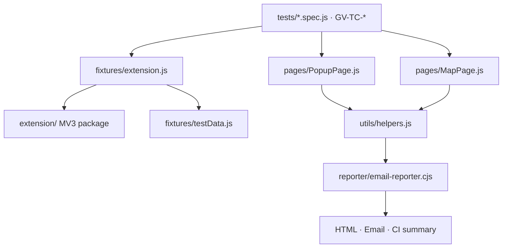
```mermaid
flowchart TB
  T[tests/*.spec.js · GV-TC-*] --> F[fixtures/extension.js]
  F --> EXT[extension/ MV3 package]
  T --> P[pages/PopupPage.js]
  T --> M[pages/MapPage.js]
  P --> H[utils/helpers.js]
  M --> H
  F --> D[fixtures/testData.js]
  H --> R[reporter/email-reporter.cjs]
  R --> OUT[HTML · Email · CI summary]
```

| Layer | Responsibility |
| ----- | -------------- |
| Specs | Business scenarios, arrange/act/assert |
| Page objects | Selectors, numbered steps, waits |
| Fixtures | Extension load, `extensionId`, test-data paths |
| Helpers | `logInfo`, `showStep`, DIAG, screenshots |
| Reporter | Status model, dual emails, attachments |

---

# 6. Repository Structure

```text
Mrsid-Extension/
├── extension/                 # MV3 package under test
│   ├── manifest.json
│   ├── popup.html / popup.js
│   ├── map.html / map.js
│   ├── logo / leaflet / styles
│   └── …
├── pages/
│   ├── PopupPage.js           # Upload, process, metadata, download, clear
│   └── MapPage.js             # map.html, layers, empty state
├── fixtures/
│   ├── extension.js           # Load unpacked extension + context
│   └── testData.js            # Central fixture path registry
├── tests/                     # *.spec.js — GV-TC-* cases
├── test-data/
│   ├── valid/                 # SID, GeoTIFF, multi-file, large
│   ├── invalid/               # non-georef, wrong types
│   ├── corrupt/
│   ├── boundary/              # empty, tiny, UPPERCASE
│   ├── gis/                   # regional / projection sets
│   └── negative/
├── utils/helpers.js           # Steps, logging, DIAG, overlays
├── reporter/
│   ├── email-reporter.cjs     # Daily + detailed emails
│   └── shard-metrics.cjs
├── .github/workflows/playwright.yml
├── playwright.config.js
├── package.json
└── README.md
```

---

# 7. Test Execution Lifecycle

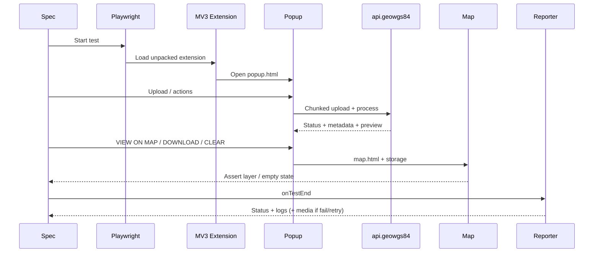
```mermaid
sequenceDiagram
  participant Spec
  participant PW as Playwright
  participant Ext as MV3 Extension
  participant Popup
  participant API as api.geowgs84
  participant Map
  participant Rep as Reporter

  Spec->>PW: Start test
  PW->>Ext: Load unpacked extension
  Ext->>Popup: Open popup.html
  Spec->>Popup: Upload / actions
  Popup->>API: Chunked upload + process
  API-->>Popup: Status + metadata + preview
  Spec->>Popup: VIEW ON MAP / DOWNLOAD / CLEAR
  Popup->>Map: map.html + storage
  Map-->>Spec: Assert layer / empty state
  Spec->>Rep: onTestEnd
  Rep-->>Spec: Status + logs (+ media if fail/retry)
```

---

# 8. Test Data Architecture

```text
test-data/
├── valid/          01_NAIP_*.sid/.tif, multi-file set, large_1GB*, Ireland 1.69GB
├── invalid/        non_georeferenced.*, unsupported types
├── corrupt/        corrupt.sid / .tif
├── boundary/       empty.tif, tiny.sid, VALID_UPPER_*.SID/.TIF
├── gis/            hemisphere / projection variants
└── negative/       deceptive names, no-extension samples
```

| Category | Use |
| -------- | --- |
| valid | Happy path, map, download, regression |
| invalid / negative | Client rejection, no false success |
| corrupt | Stable error handling |
| gis | Metadata + map placement |
| large-files | `@large-file` performance / stability |
| boundary | Empty, uppercase, edge filenames |

Paths are centralized in `fixtures/testData.js` (`TestData.validSid`, `TestData.large1GB`, …).

---

# 9. Execution Strategy & Validation Categories

```text
Arrange → load extension / open popup
Act     → upload, click, map, download
Assert  → status, metadata, UI, map, download event
Report  → logInfo + email status model
```

| Category | Purpose |
| -------- | ------- |
| UI | Popup idle, viewport, controls |
| Functional | Upload → process → preview → map → TIFF |
| Negative | Unsupported / empty / deceptive files |
| GIS | Projection, bounds, hemispheres, placement |
| Performance | GB-scale SID/GeoTIFF |
| Security | Manifest, WAR, secret scan |
| Regression | Full suite on CI |

---

# 10. Test Suite Overview

**~55 tests** · project `chromium-extension` · tags `@smoke` `@p0` `@p1` `@p2` `@upload` `@map` `@large-file` `@security`

| Suite area | Typical specs | Focus |
| ---------- | ------------- | ----- |
| Startup / ready | `01-popup.ready`, `12-ui.viewport` | System Ready, logo, accept, layout |
| Valid upload | `02-popup.upload.valid` | SID/TIF/TIFF, map, clear, TIFF button |
| Invalid | `03-popup.upload.invalid` | Reject bad types / empty |
| Metadata & map | `09-metadata.map.*` | Regional / rotated / multi-layer |
| DnD / multi / UI | `05`, `10-upload.dragdrop` | Drop, progress, zoom |
| Download | `13-download.tiff` | Real browser download |
| Large | `08-large.file` | 1–1.69GB |
| Security / empty map | `11-security`, `14-map.empty` | Manifest, empty/malformed storage |

---

# 11. Per-Testcase Workflows

Each case below includes **objective**, **workflow diagram**, **what is checked**, and **pass / fail criteria**.

Legend: blue = action · yellow = wait/decision · green = pass · red = fail.

---

## 11.1 Ready & Viewport

### GV-TC-001-01 — Popup opens and shows System Ready

**Objective:** Idle popup is fully ready before any upload.

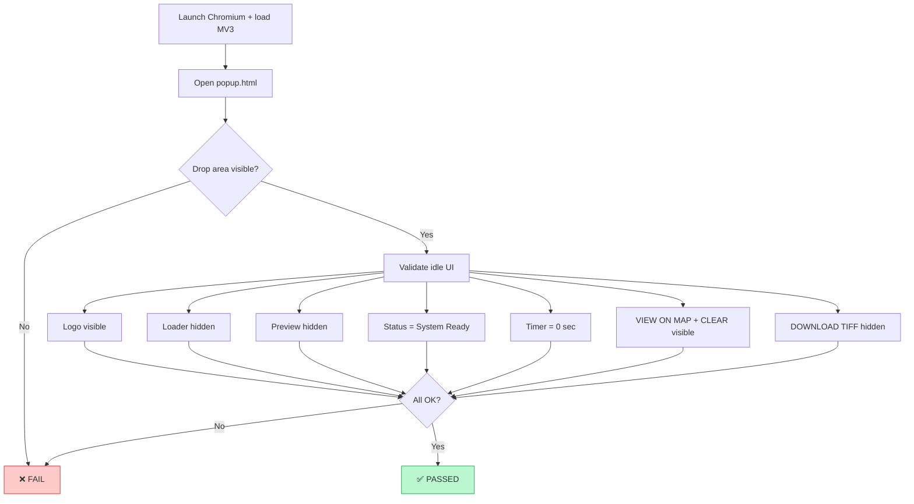
```mermaid
flowchart TD
  A[Launch Chromium + load MV3] --> B[Open popup.html]
  B --> C{Drop area visible?}
  C -->|No| X[❌ FAIL]
  C -->|Yes| D[Validate idle UI]
  D --> D1[Logo visible]
  D --> D2[Loader hidden]
  D --> D3[Preview hidden]
  D --> D4[Status = System Ready]
  D --> D5[Timer = 0 sec]
  D --> D6[VIEW ON MAP + CLEAR visible]
  D --> D7[DOWNLOAD TIFF hidden]
  D1 --> E{All OK?}
  D2 --> E
  D3 --> E
  D4 --> E
  D5 --> E
  D6 --> E
  D7 --> E
  E -->|Yes| P[✅ PASSED]
  E -->|No| X
  style P fill:#bbf7d0,stroke:#16a34a
  style X fill:#fecaca,stroke:#dc2626
```

| Check | Criteria |
| ----- | -------- |
| Extension | Loads; popup opens |
| Status | System Ready |
| Timer | Idle **0 sec** |
| Buttons | Map + Clear on; Download TIFF off |

**Fails when:** popup crash, missing controls, wrong idle state.

---

### GV-TC-001-02 — File input accept lists supported extensions

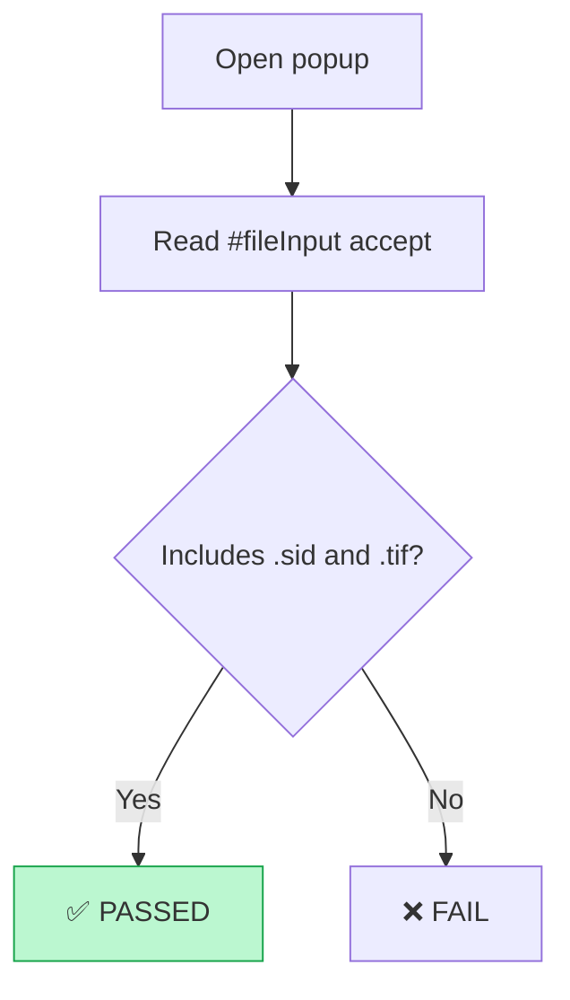
```mermaid
flowchart TD
  A[Open popup] --> B[Read #fileInput accept]
  B --> C{Includes .sid and .tif?}
  C -->|Yes| P[✅ PASSED]
  C -->|No| X[❌ FAIL]
  style P fill:#bbf7d0,stroke:#16a34a
```

| Check | Criteria |
| ----- | -------- |
| `accept` | Contains `.sid` and `.tif` (plus packaged types) |

---

### GV-TC-001-03 — No critical console errors on popup load

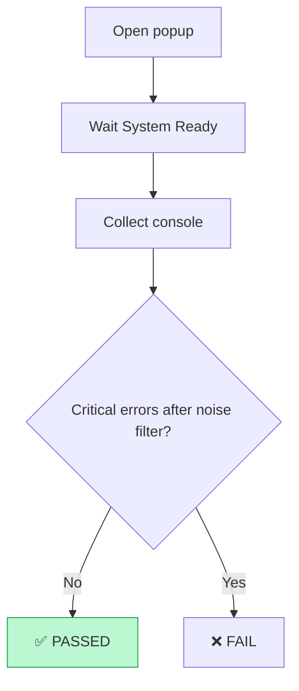
```mermaid
flowchart TD
  A[Open popup] --> B[Wait System Ready]
  B --> C[Collect console]
  C --> D{Critical errors after noise filter?}
  D -->|No| P[✅ PASSED]
  D -->|Yes| X[❌ FAIL]
  style P fill:#bbf7d0,stroke:#16a34a
```

| Check | Criteria |
| ----- | -------- |
| Console | No product-critical errors; infra noise ignored |

---

### GV-TC-001-04 — Popup static assets render (logo)

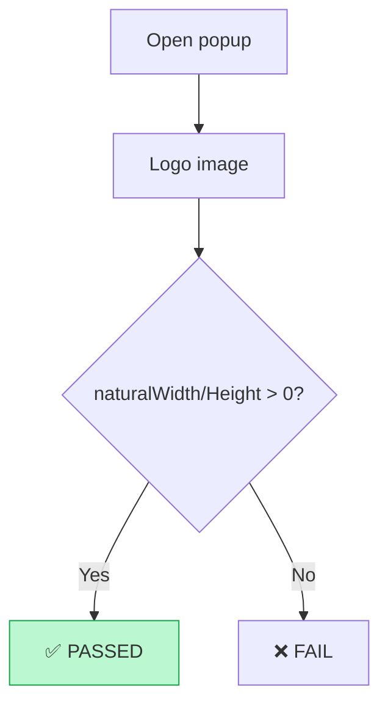
```mermaid
flowchart TD
  A[Open popup] --> B[Logo image]
  B --> C{naturalWidth/Height > 0?}
  C -->|Yes| P[✅ PASSED]
  C -->|No| X[❌ FAIL]
  style P fill:#bbf7d0,stroke:#16a34a
```

---

### GV-TC-001-05 — Layout at 1920×1080 / 1366×768 / 800×600

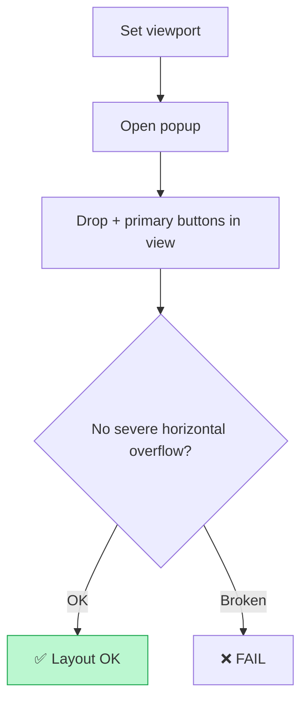
```mermaid
flowchart TD
  A[Set viewport] --> B[Open popup]
  B --> C[Drop + primary buttons in view]
  C --> D{No severe horizontal overflow?}
  D -->|OK| P[✅ Layout OK]
  D -->|Broken| X[❌ FAIL]
  style P fill:#bbf7d0,stroke:#16a34a
```

| Viewport | Criteria |
| -------- | -------- |
| 1920 / 1366 / 800 | Controls usable; layout stable |

---

## 11.2 Valid Upload & Processing

Shared pipeline:

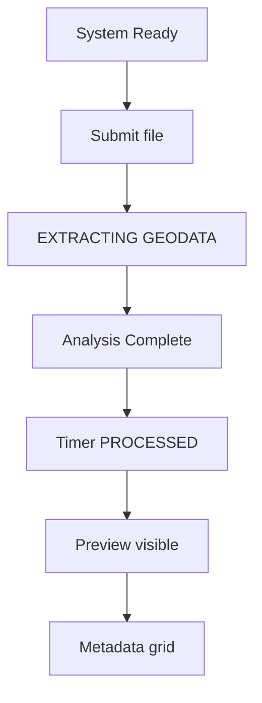
```mermaid
flowchart TD
  S[System Ready] --> U[Submit file]
  U --> E[EXTRACTING GEODATA]
  E --> A[Analysis Complete]
  A --> T[Timer PROCESSED]
  T --> V[Preview visible]
  V --> M[Metadata grid]
```

### GV-TC-003-01 — Valid .sid → preview + full metadata

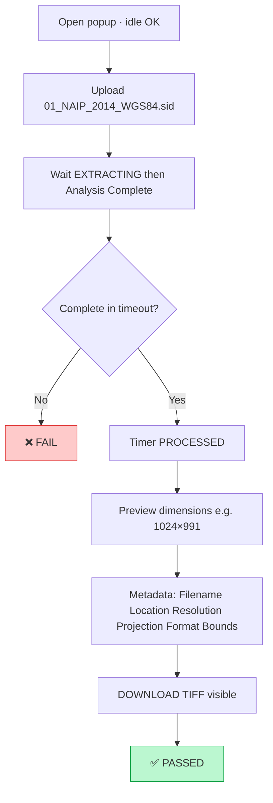
```mermaid
flowchart TD
  A[Open popup · idle OK] --> B[Upload 01_NAIP_2014_WGS84.sid]
  B --> C[Wait EXTRACTING then Analysis Complete]
  C --> D{Complete in timeout?}
  D -->|No| X[❌ FAIL]
  D -->|Yes| E[Timer PROCESSED]
  E --> F[Preview dimensions e.g. 1024×991]
  F --> G[Metadata: Filename Location Resolution Projection Format Bounds]
  G --> H[DOWNLOAD TIFF visible]
  H --> P[✅ PASSED]
  style P fill:#bbf7d0,stroke:#16a34a
  style X fill:#fecaca,stroke:#dc2626
```

| Criterion | Expected |
| --------- | -------- |
| Status | Analysis Complete |
| Preview | Visible, non-zero size |
| Metadata | Core GIS fields present |
| TIFF button | Visible for SID |

---

### GV-TC-003-02 — Valid .tif → preview + full metadata

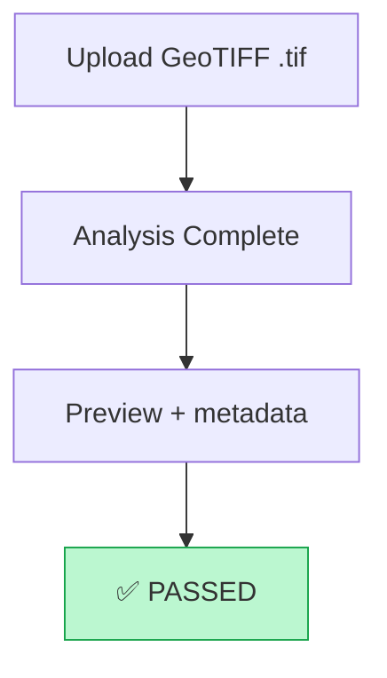
```mermaid
flowchart TD
  A[Upload GeoTIFF .tif] --> B[Analysis Complete]
  B --> C[Preview + metadata]
  C --> P[✅ PASSED]
  style P fill:#bbf7d0,stroke:#16a34a
```

---

### GV-TC-003-03 — Valid .tiff starts processing

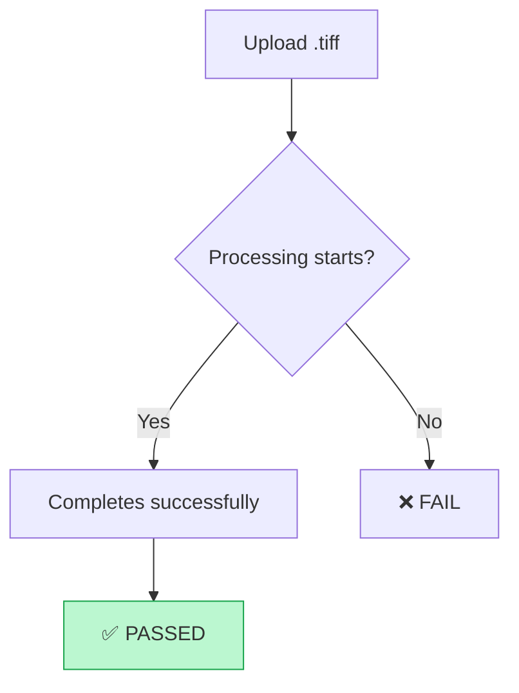
```mermaid
flowchart TD
  A[Upload .tiff] --> B{Processing starts?}
  B -->|Yes| C[Completes successfully]
  C --> P[✅ PASSED]
  B -->|No| X[❌ FAIL]
  style P fill:#bbf7d0,stroke:#16a34a
```

---

### GV-TC-003-05 — UPPERCASE .SID / .TIF accepted

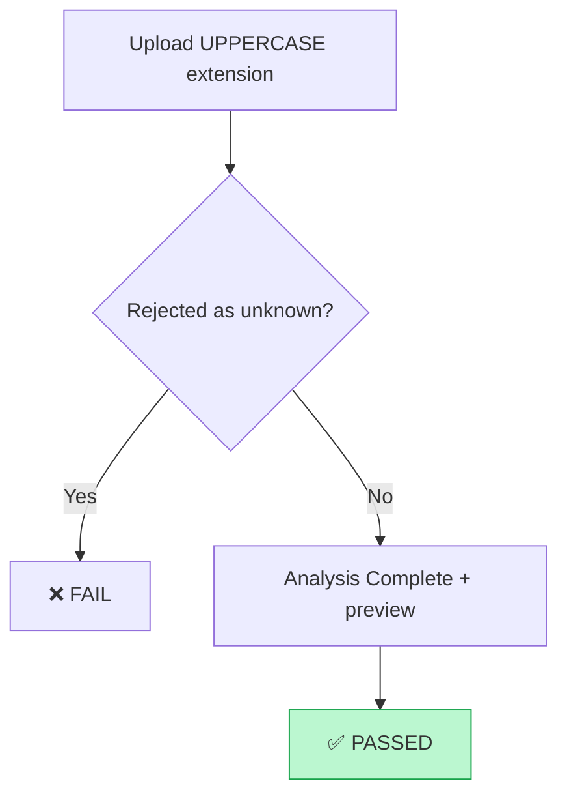
```mermaid
flowchart TD
  A[Upload UPPERCASE extension] --> B{Rejected as unknown?}
  B -->|Yes| X[❌ FAIL]
  B -->|No| C[Analysis Complete + preview]
  C --> P[✅ PASSED]
  style P fill:#bbf7d0,stroke:#16a34a
```

---

### GV-TC-002-01 — VIEW ON MAP renders raster (highlighted)

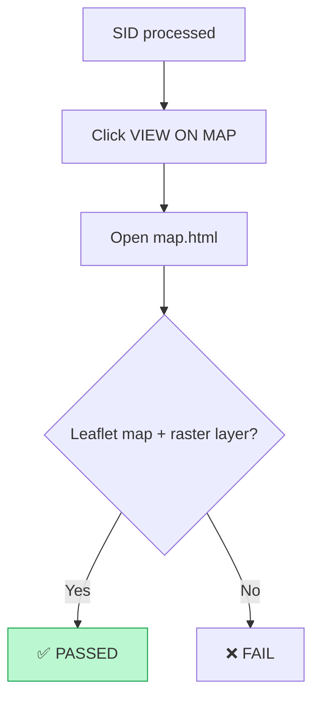
```mermaid
flowchart TD
  A[SID processed] --> B[Click VIEW ON MAP]
  B --> C[Open map.html]
  C --> D{Leaflet map + raster layer?}
  D -->|Yes| P[✅ PASSED]
  D -->|No| X[❌ FAIL]
  style P fill:#bbf7d0,stroke:#16a34a
```

| Criterion | Expected |
| --------- | -------- |
| Map | Loads; raster highlighted/visible |

---

### GV-TC-010-01 — Clear after successful upload

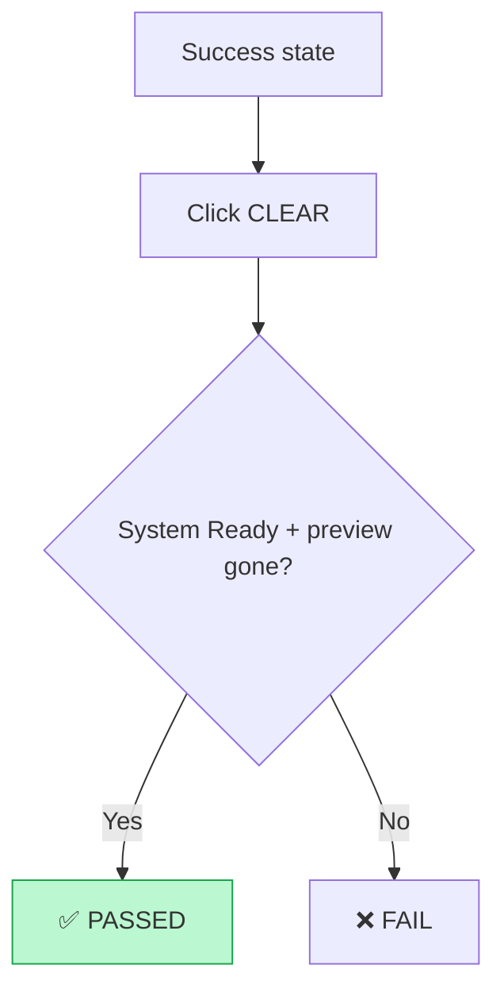
```mermaid
flowchart TD
  A[Success state] --> B[Click CLEAR]
  B --> C{System Ready + preview gone?}
  C -->|Yes| P[✅ PASSED]
  C -->|No| X[❌ FAIL]
  style P fill:#bbf7d0,stroke:#16a34a
```

---

### GV-TC-014-01 — DOWNLOAD TIFF visible after valid process

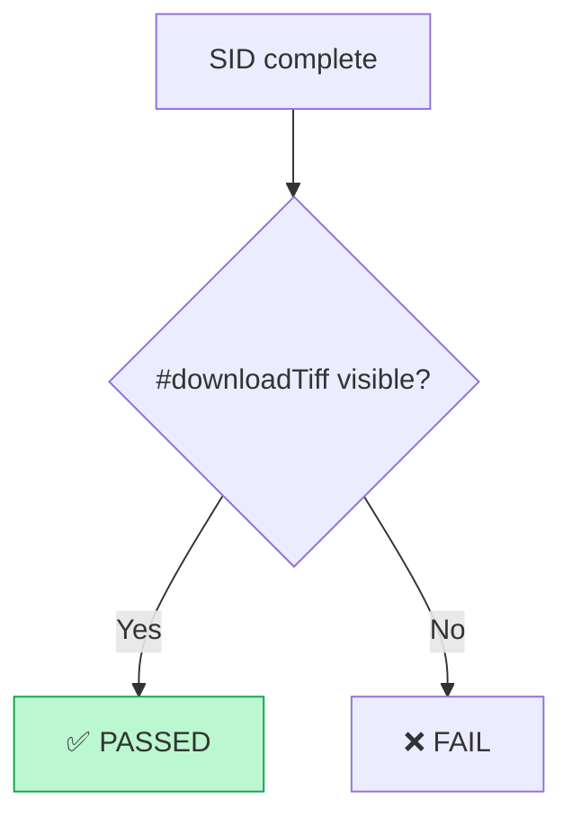
```mermaid
flowchart TD
  A[SID complete] --> B{#downloadTiff visible?}
  B -->|Yes| P[✅ PASSED]
  B -->|No| X[❌ FAIL]
  style P fill:#bbf7d0,stroke:#16a34a
```

---

## 11.3 Invalid / Negative Uploads

### GV-TC-004-01 — Unsupported .gif rejected client-side

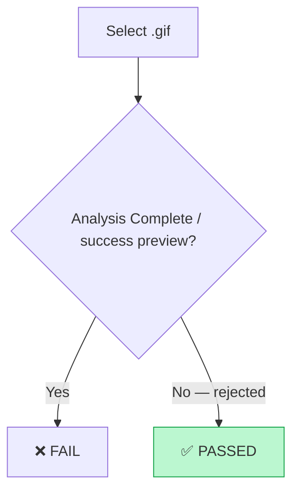
```mermaid
flowchart TD
  A[Select .gif] --> B{Analysis Complete / success preview?}
  B -->|Yes| X[❌ FAIL]
  B -->|No — rejected| P[✅ PASSED]
  style P fill:#bbf7d0,stroke:#16a34a
```

### GV-TC-004-01b — .jpg / .png / .pdf rejected

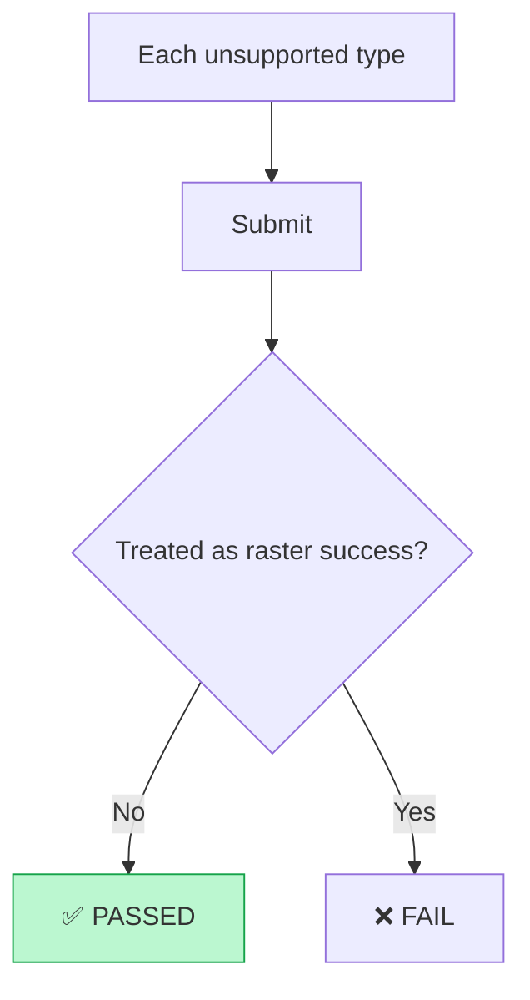
```mermaid
flowchart TD
  A[Each unsupported type] --> B[Submit]
  B --> C{Treated as raster success?}
  C -->|No| P[✅ PASSED]
  C -->|Yes| X[❌ FAIL]
  style P fill:#bbf7d0,stroke:#16a34a
```

### GV-TC-004-02 — Deceptive double-extension rejected

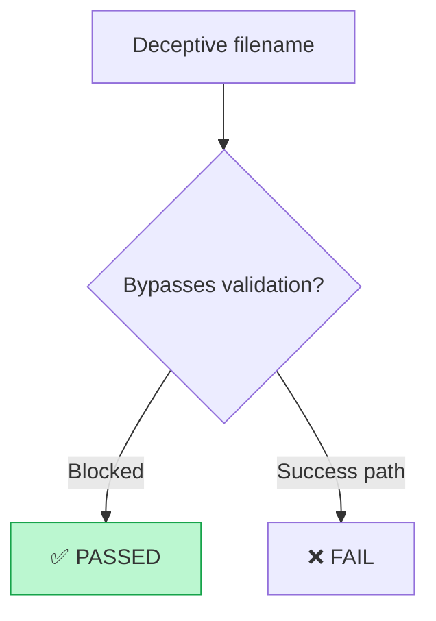
```mermaid
flowchart TD
  A[Deceptive filename] --> B{Bypasses validation?}
  B -->|Blocked| P[✅ PASSED]
  B -->|Success path| X[❌ FAIL]
  style P fill:#bbf7d0,stroke:#16a34a
```

### GV-TC-004-03 — No extension rejected

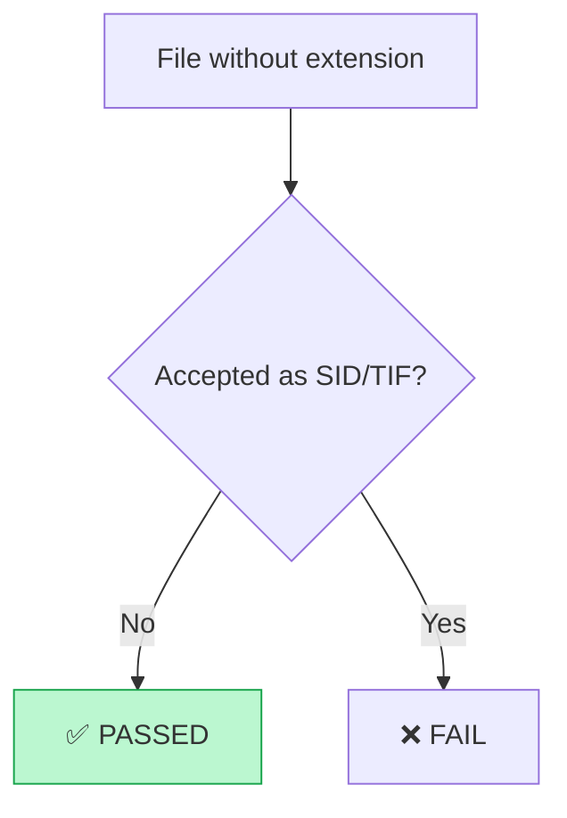
```mermaid
flowchart TD
  A[File without extension] --> B{Accepted as SID/TIF?}
  B -->|No| P[✅ PASSED]
  B -->|Yes| X[❌ FAIL]
  style P fill:#bbf7d0,stroke:#16a34a
```

### GV-TC-005-04 — Empty / zero-byte does not produce success

```mermaid
flowchart TD
  A[Upload empty file] --> B{Success UI?}
  B -->|No| P[✅ PASSED]
  B -->|Yes| X[❌ FAIL]
  style P fill:#bbf7d0,stroke:#16a34a
```

**Pass rule (all negative):** file rejected or non-success; **no crash**.

---

## 11.4 Metadata & Map Placement (GV-TC-006-*, 009-*)

```mermaid
flowchart TD
  A[Upload regional / rotated fixture] --> B[Analysis Complete]
  B --> C[Validate Location / Bounds / Projection]
  C --> D[VIEW ON MAP]
  D --> E{Map stable + layer?}
  E -->|Yes| P[✅ PASSED]
  E -->|No| X[❌ FAIL]
  style P fill:#bbf7d0,stroke:#16a34a
```

| IDs | Focus |
| --- | ----- |
| GV-TC-006-01 … 006-07b | Regions, SW hemisphere, rotated NAIP `@map` |
| GV-TC-009-01 … 009-04 | Extra metadata / edge placements |

**Criteria:** Metadata matches fixture; map does not crash; layer present when expected.

---

## 11.5 Multi-file, Drag-Drop & UI

### GV-TC-003-04 — Drag & drop valid .sid

```mermaid
flowchart TD
  A[Drop .sid on #dropArea] --> B[Analysis Complete]
  B --> C[Preview + metadata]
  C --> P[✅ Same as file-input path]
  style P fill:#bbf7d0,stroke:#16a34a
```

### GV-TC-008-05 / 008-06a–c — Multi-file progress variants

```mermaid
flowchart TD
  A[Multi-file subset] --> B[Progress / status UI]
  B --> C{Coherent status?}
  C -->|Yes| P[✅ PASSED]
  C -->|No| X[❌ FAIL]
  style P fill:#bbf7d0,stroke:#16a34a
```

### GV-TC-008-07 — Multi-file set + map layers

```mermaid
flowchart TD
  A[Full multi-file set] --> B[All process]
  B --> C[Open map · layers]
  C --> D{OK or retry then OK?}
  D -->|Yes| P[✅ PASSED / PASSED*]
  D -->|No| X[❌ FAIL]
  style P fill:#bbf7d0,stroke:#16a34a
```

### GV-TC-010-02 — Zoom controls after preview

```mermaid
flowchart TD
  A[Preview ready] --> B[zoomIn / zoomOut / reset visible]
  B --> P[✅ PASSED]
  style P fill:#bbf7d0,stroke:#16a34a
```

### GV-TC-011-01 / 011-02 / 012-01 / 013-01 — UI / status variants

```mermaid
flowchart TD
  A[Drive UI to target state] --> B[Assert control or copy]
  B --> C{Matches product?}
  C -->|Yes| P[✅ PASSED]
  C -->|No| X[❌ FAIL]
  style P fill:#bbf7d0,stroke:#16a34a
```

---

## 11.6 Download TIFF

### GV-TC-014-03 — Click starts a download

```mermaid
flowchart TD
  A[SID complete · button visible] --> B[Click DOWNLOAD TIFF]
  B --> C{Playwright download event?}
  C -->|Yes · .tif name| P[✅ PASSED]
  C -->|No| X[❌ FAIL]
  style P fill:#bbf7d0,stroke:#16a34a
```

| Criterion | Expected |
| --------- | -------- |
| Event | Download starts |
| Name | e.g. `01_NAIP_2014_WGS84.tif` |

---

## 11.7 Large Files (`@large-file`)

| ID | Fixture | Validates |
| -- | ------- | --------- |
| GV-TC-006-08 | ~1GB MrSID | Preview + metadata |
| GV-TC-006-08b | ~1.3GB Alaska | Preview |
| GV-TC-006-08c | ~1.69GB Ireland GeoTIFF | Preview |
| GV-TC-014-02 | 1GB | VIEW ON MAP + highlight |
| GV-TC-023-02 | 1GB | Process-time baseline logged |

```mermaid
flowchart TD
  A[Upload GB-scale file] --> B[Chunked API upload]
  B --> C{Transient session errors?}
  C -->|Re-init / retry chunks| B
  C -->|Done| D[Long wait → Analysis Complete]
  D --> E[Preview / map / timing as per case]
  E --> P[✅ PASSED]
  style P fill:#bbf7d0,stroke:#16a34a
```

| Criterion | Expected |
| --------- | -------- |
| Complete | Within extended timeout |
| Stability | No crash; preview when required |
| Status noise | Upload 400 / re-init **not** Pass+Warn |

---

## 11.8 Security & Empty Map

### GV-TC-022-01 — Manifest permissions minimal (MV3)

```mermaid
flowchart TD
  A[Read manifest.json] --> B{permissions minimal e.g. storage?}
  B -->|Extra risky| X[❌ FAIL]
  B -->|OK| C{host_permissions only API host?}
  C -->|OK| P[✅ PASSED]
  C -->|Too wide| X
  style P fill:#bbf7d0,stroke:#16a34a
```

### GV-TC-022-02 — web_accessible_resources documented

```mermaid
flowchart TD
  A[Read WAR] --> B[Log resources + matches]
  B --> C[Expected assets listed]
  C --> P[✅ PASSED]
  style P fill:#bbf7d0,stroke:#16a34a
```

### GV-TC-022-05 — No obvious secrets in package

```mermaid
flowchart TD
  A[Scan packaged files] --> B{Keys / passwords / tokens?}
  B -->|Found| X[❌ FAIL]
  B -->|Clean| P[✅ PASSED]
  style P fill:#bbf7d0,stroke:#16a34a
```

### GV-TC-002-01b — map.html empty state

```mermaid
flowchart TD
  A[Open map with empty storage] --> B{Crash?}
  B -->|Yes| X[❌ FAIL]
  B -->|No| C[Empty-state message]
  C --> P[✅ PASSED]
  style P fill:#bbf7d0,stroke:#16a34a
```

### GV-TC-002-02 — Malformed mapDataList does not crash

```mermaid
flowchart TD
  A[Seed not-json / {} / [] / broken] --> B[Open map each time]
  B --> C{Any crash?}
  C -->|No| P[✅ PASSED]
  C -->|Yes| X[❌ FAIL]
  style P fill:#bbf7d0,stroke:#16a34a
```

---

# 12. Page Object Model

```mermaid
flowchart TD
  Specs --> PopupPage
  Specs --> MapPage
  PopupPage --> ExtensionUI
  MapPage --> ExtensionUI
```

**PopupPage:** open, idle validate, upload / drag-drop, wait processing, metadata, preview, VIEW ON MAP, DOWNLOAD TIFF, CLEAR, zoom controls.

**MapPage:** open `map.html`, empty-state diagnostics, layer presence, malformed storage seeds.

**Rule:** selectors and clicks live in page objects; specs describe behaviour.

---

# 13. Fixtures & Utilities

### Extension fixture
Browser launch · `--load-extension` · `extensionId` · console/DIAG hooks · noise filters.

### testData fixture
Stable paths for valid/invalid/large/boundary GIS files.

### helpers.js
`setContext`, `showStep`, `logInfo` (also → shard DIAG as `test-step`), warnings/errors, screenshots, visual overlays.

---

# 14. Reporting & Status Model

### Dual emails

| Email | Env | Audience | Content |
| ----- | --- | -------- | ------- |
| Daily | `DAILY_REPORT_EMAILS` | Director | Passed · Pass+Warn · Failed · Skipped |
| Detailed | `FAILURE_ALERT_EMAILS` | QA / Dev | Per-test START/END logs; SS/video on fail/retry |

### Status priority

```text
1. FAILED               final failed | timedOut
2. SKIPPED              skipped | skip-logic
3. PASSED WITH WARNING  passed + real product warnings
4. PASSED               passed + no real warnings
                        (retry→pass counts as Passed; QA badge PASSED*)
```

```mermaid
flowchart TD
  A[Test ends] --> B{Playwright status}
  B -->|failed/timedOut| F[FAILED + media]
  B -->|skipped| S[SKIPPED]
  B -->|passed| C{Real warnings after filter?}
  C -->|yes| W[PASS + WARN · logs only]
  C -->|no| P[PASSED / PASSED* if retry]
```

### Attachments

| Scenario | Screenshot | Video |
| -------- | ---------- | ----- |
| FAILED | Yes | Yes (≥ 50 KB) |
| Retry recovered | Yes | Yes |
| Pass+Warn / clean pass | No | No |

**Noise ignored:** upload not initialized, chunk retry, HTTP 400/404, CDP, tracing, target closed, browser-memory heap.

---

# 15. CI/CD Pipeline

```mermaid
flowchart TD
  A[Push / PR / cron 07:30 UTC / manual] --> B[Delete ALL previous completed runs]
  B --> C[Prepare · discover tests · fixture cache]
  C --> D[Matrix shards 1–8 · 1 worker each]
  D --> E[Merge blobs · dashboard · artifacts]
  E --> F[Daily email]
  E --> G[QA detailed email]
```

Stages: cleanup → prepare → test matrix → consolidated report → email.

Parallelism: **8 shards** (not unbounded workers on one extension context). Large fixtures cached (Drive IDs in workflow env).

---

# 16. Configuration & Environment

### playwright.config.js (typical)

| Setting | Value |
| ------- | ----- |
| Project | `chromium-extension` |
| fullyParallel | true (shard by test) |
| Retries | 1 on CI; large-file describe may use 2 |
| Trace | `on-first-retry` |
| Screenshot | `only-on-failure` |
| Video | `retain-on-failure` |
| Timeout | Elevated for processing / large files |

### Environment

```env
SMTP_HOST=smtp.gmail.com
SMTP_PORT=587
SMTP_SECURE=false
SMTP_USER=...
SMTP_PASS=app_password_no_spaces
SMTP_FROM=...
DAILY_REPORT_EMAILS=...
FAILURE_ALERT_EMAILS=...
ENABLE_EMAIL_REPORTER=true
PW_PROCESSING_TIMEOUT_MS=...   # optional
```

Use Gmail **App Passwords**; trim secrets (no trailing newlines).

---

# 17. Setup & Running Tests

### Requirements

| Item | Version |
| ---- | ------- |
| OS | Linux / Windows / macOS |
| Node.js | 18+ (CI uses 22) |
| npm | 9+ |
| Browser | Chromium via Playwright |

### Install

```bash
git clone <repo-url> && cd Mrsid-Extension
npm ci
npx playwright install --with-deps chromium
```

### Commands

```bash
npx playwright test                          # full suite
npx playwright test --grep-invert @large-file
npx playwright test --grep @large-file
npx playwright test --grep @security
npx playwright test -g "GV-TC-003-01"
npx playwright test --headed
npx playwright test --debug -g "GV-TC-001-01"
npx playwright show-report
```

### CI manual run
**Actions → Playwright Tests - MrSID Viewer Extension → Run workflow**  
(optional grep, send_report, headless, debug).

---

# 18. Troubleshooting

| Issue | Checks |
| ----- | ------ |
| Extension does not load | `extension/manifest.json`, path, MV3 service worker |
| Upload failures | Fixture path exists, API reachability, timeout |
| Map blank / crash | Processing success first; storage payload; Leaflet assets in WAR |
| Large file timeout | `PW_PROCESSING_TIMEOUT_MS`, shard logs, API health |
| CI fail / local pass | Secrets, fixture cache, headless, dependency install |
| Email not received | SMTP_* trimmed, App Password, `ENABLE_EMAIL_REPORTER` |
| Junk video in mail | Fixed: only fail/retry + videos ≥ 50 KB |

**Failure artifacts:** screenshots, traces (`on-first-retry`), videos (`retain-on-failure`), step logs in QA email.

---

# 19. Quality Gates & Release

```mermaid
flowchart TD
  Build[Build / package extension] --> Smoke[Smoke GV-TC-001 / 003]
  Smoke --> Func[Full functional + GIS]
  Func --> Perf[Large-file suite]
  Perf --> Sec[Security 022-*]
  Sec --> Report[CI + email green]
  Report --> Decision{Quality gate}
  Decision -->|Pass| Release[Release]
  Decision -->|Fail| Fix[Fix and re-run]
```

| Gate | Requirement |
| ---- | ----------- |
| Startup / UI | Pass |
| Upload / process / metadata | Pass |
| Map / download | Pass |
| Negative handling | Pass |
| Security | Pass |
| Large files | Pass or accepted waiver |
| Director email | 0 Failed (Pass+Warn reviewed) |

---

# 20. Future Enhancements

1. **Visual regression** — baseline screenshots for popup/map  
2. **Performance dashboard** — track GV-TC-023-02 timings over time  
3. **Auto defect filing** — Jira/GitHub from failed QA emails  
4. **Historical comparison** — day-over-day status in reporter  
5. **Dockerized runners** — identical local/CI images  

---

## Project Benefits

| Benefit | How |
| ------- | --- |
| Faster validation | Full E2E on every push/schedule |
| Release confidence | GIS + large + security covered |
| Maintainability | POM + central test-data + helpers |
| Clear reporting | Dual emails, final-status model, step logs |
| Low noise | Infra warnings filtered from Pass+Warn |

---

## Final Summary

This framework validates the MrSID Viewer Extension from **load → upload → process → metadata → map → download**, including **negative, large-file, and security** paths, with **sharded CI** and **director + QA email** reporting.

✅ Startup & UI · ✅ SID/TIFF processing · ✅ Metadata & GIS · ✅ Map · ✅ Large data · ✅ Security · ✅ CI/CD

---

<div align="center">

**🌍 GeoWGS84 · MrSID Viewer Extension QA**

*Every GV-TC has objective · workflow · checks · pass/fail criteria*

</div>
