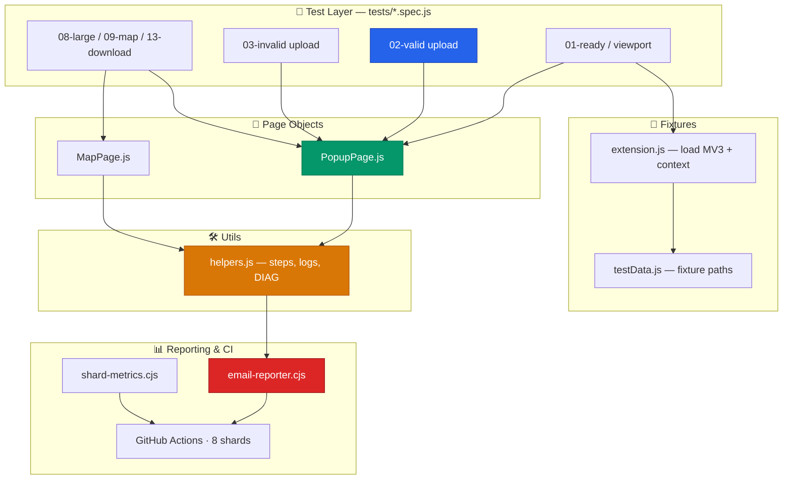
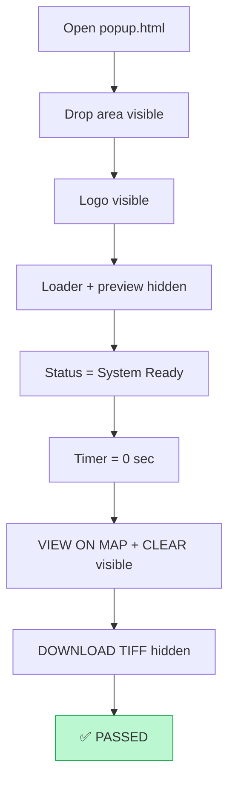
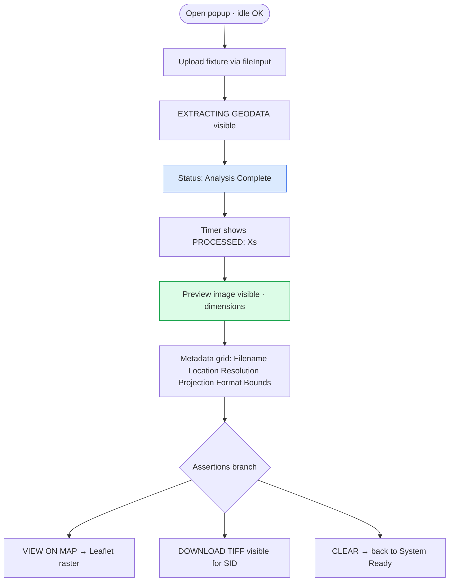
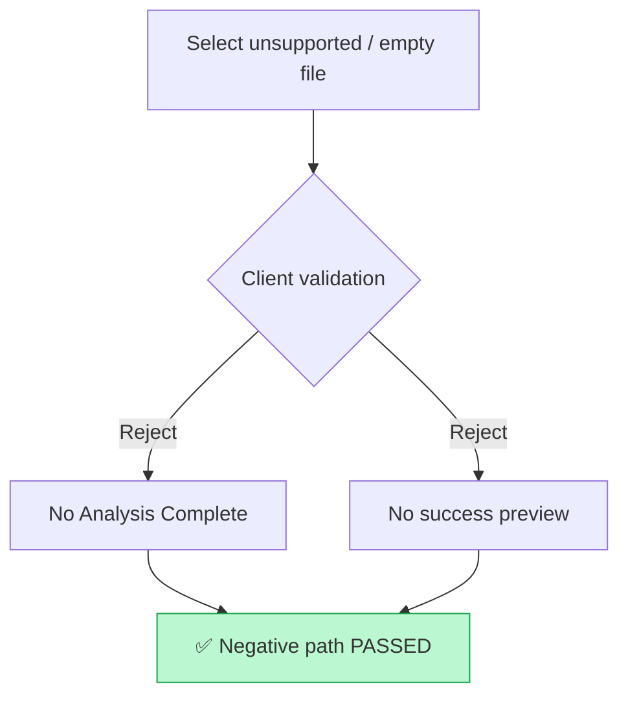
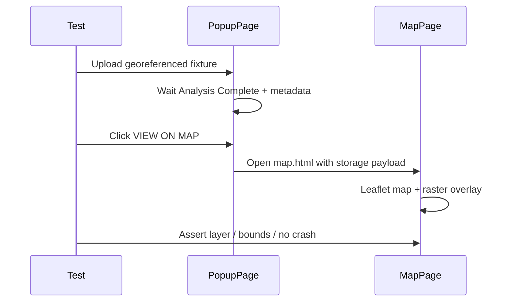
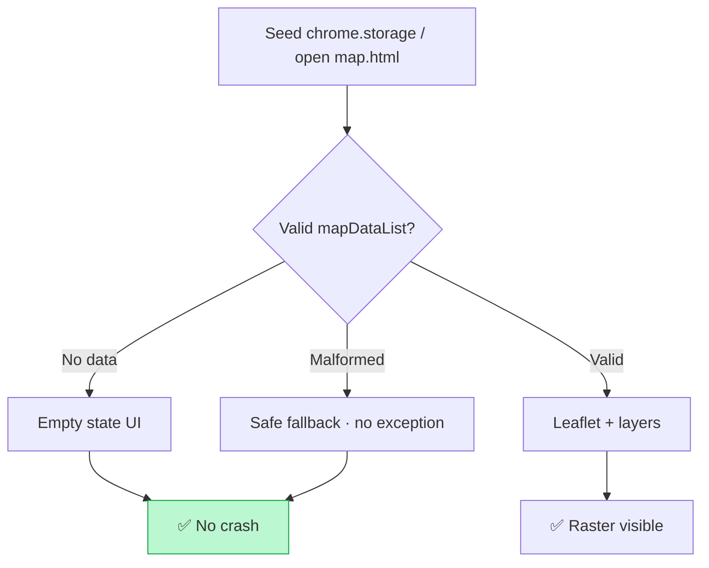
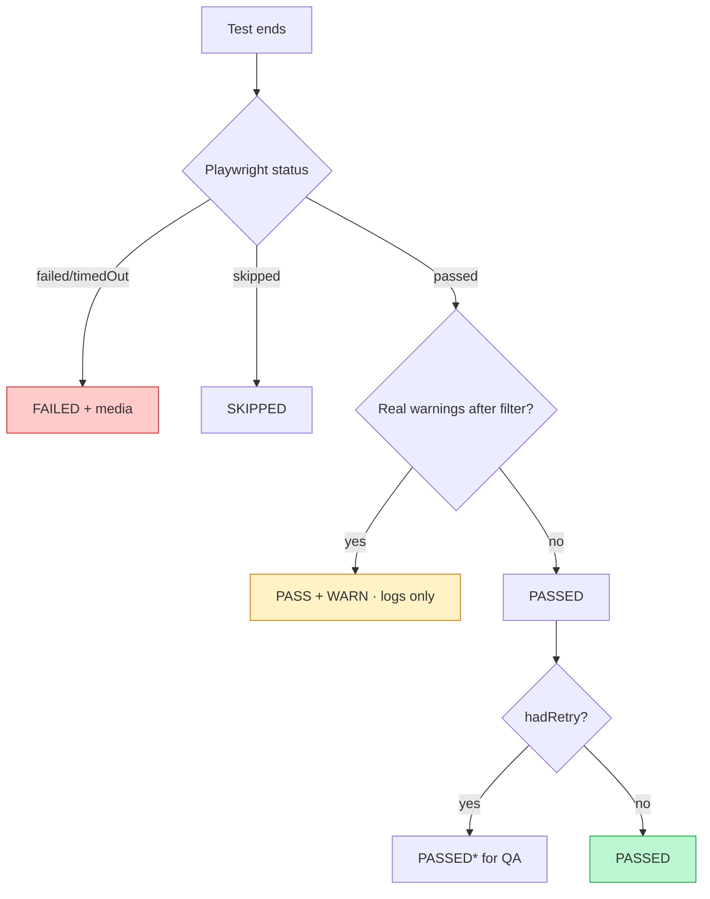

# 🗺️ MrSID Viewer Extension — Automation Test Suite

<div align="center">


**🚀 End-to-End Automation for the MrSID Viewer Chrome Extension (MV3)**  
*Upload · Process · Preview · Map · Download — fully validated*

<br>

```
┌──────────────────────────────────────────────────────────────┐
│  🧩 Chrome MV3 Extension                                      │
│  popup.html  ·  map.html  ·  Leaflet raster  ·  api.geowgs84  │
└───────────────────────────┬──────────────────────────────────┘
                            │
        ┌───────────────────┼───────────────────┐
        ▼                   ▼                   ▼
   📤 Upload           🛰️ Process            🗺️ Map / TIFF
   .sid / .tif         metadata + preview    VIEW ON MAP
   drag-drop           timer + status        DOWNLOAD TIFF
```

</div>

---

## 📚 Table of Contents

1. [🏗️ Architecture & Design Patterns](#-architecture--design-patterns)
2. [🔄 CI/CD Pipeline](#-cicd-pipeline)
3. [🧪 Test Suite Overview](#-test-suite-overview)
4. [📗 Popup Ready & UI](#-popup-ready--ui)
5. [📤 Valid Upload & Processing](#-valid-upload--processing)
6. [🚫 Invalid / Negative Uploads](#-invalid--negative-uploads)
7. [🌍 Metadata & Map Placement](#-metadata--map-placement)
8. [📦 Multi-file, Drag-Drop & Controls](#-multi-file-drag-drop--controls)
9. [⬇️ Download TIFF](#-download-tiff)
10. [🐘 Large Files](#-large-files)
11. [🔒 Security & Empty Map](#-security--empty-map)
12. [🧠 Under the Hood](#-under-the-hood)
13. [📧 Reporting & Status Model](#-reporting--status-model)
14. [⚙️ Configuration Matrix](#-configuration-matrix)
15. [🚀 Setup & Execution](#-setup--execution)

---

## 🏗️ Architecture & Design Patterns

Layered design: specs stay thin; page objects own UI steps; helpers own logging, screenshots, and diagnostics.



### Design principles

| Principle | How we achieve it |
| --------- | ----------------- |
| **POM** | `PopupPage` / `MapPage` encapsulate selectors and numbered steps |
| **Extension-first** | Persistent Chromium context loads unpacked MV3; no public website URL under test |
| **Self-describing logs** | Every step uses `showStep` / `logInfo` → terminal + email |
| **Noise-free DIAG** | Upload 400 / CDP / tracing / heap snapshots filtered from product warnings |
| **Sharded CI** | 8 shards × 1 worker; blob merge → consolidated report + dual emails |
| **Retry-aware status** | Fail then pass → **PASSED** for director; QA sees `PASSED*` |

---

## 🔄 CI/CD Pipeline

```
⏰ schedule: 07:30 UTC daily  ·  push / PR · main  ·  workflow_dispatch
┌─────────────────────────────────────────────────────────────────────┐
│ 🧹 cleanup-previous     Delete ALL previous completed runs of this  │
│                         workflow (keep history clean)               │
├─────────────────────────────────────────────────────────────────────┤
│ 📦 prepare              Discover tests · fixture cache · shard plan │
├─────────────────────────────────────────────────────────────────────┤
│ 🧪 test (matrix 1..8)   chromium-extension · 1 worker / shard       │
│                         blob + JSON + screenshots on failure        │
├─────────────────────────────────────────────────────────────────────┤
│ 📈 dashboard            Merge blobs · shard matrix · HTML report    │
├─────────────────────────────────────────────────────────────────────┤
│ 📬 email-report         DAILY_REPORT_EMAILS  (director summary)     │
│                         FAILURE_ALERT_EMAILS (QA detailed + media)  │
└─────────────────────────────────────────────────────────────────────┘
```


---

## 🧪 Test Suite Overview

**~55 tests** · Project: `chromium-extension` · Tags: `@smoke` `@p0` `@p1` `@p2` `@upload` `@map` `@large-file` `@security`

| Area | Spec (typical) | Count (approx) | Focus |
| ---- | -------------- | -------------- | ----- |
| Ready / assets / viewport | `01-popup.ready` · `12-ui.viewport` | 7 | Idle UI, logo, accept, layout |
| Valid upload | `02-popup.upload.valid` | 7 | .sid / .tif / .tiff → preview + metadata |
| Invalid upload | `03-popup.upload.invalid` | 5 | Reject unsupported / empty / deceptive names |
| Metadata & map | `09-metadata.map.extra` + related | 10+ | Bounds, hemispheres, rotated NAIP, map layers |
| Multi-file / DnD / UI | `05` · `10-upload.dragdrop` | 5+ | Progress, clear, zoom, drag-drop |
| Download TIFF | `13-download.tiff` | 2 | Button visibility + real download |
| Large files | `08-large.file` | 5 | 1GB–1.69GB MrSID / GeoTIFF |
| Security / empty map | `11-security` · `14-map.empty` | 5 | Manifest, WAR, no secrets, empty/malformed storage |

---

## 📗 Popup Ready & UI

### GV-TC-001-01 — Popup opens and shows System Ready

> 🏷️ **@smoke** · Validates idle chrome before any upload



**Checks:** `#dropArea`, `#statusValue`, `#timer`, buttons visibility matrix for idle state.

---

### GV-TC-001-02 — File input `accept` lists supported extensions

**Checks:** `#fileInput` `accept` includes `.sid` and `.tif` (also `.tiff` / image types as packaged).

---

### GV-TC-001-03 — No critical console errors on popup load

**Checks:** Navigate to popup → wait System Ready → assert no critical browser console errors (filtered noise ignored).

---

### GV-TC-001-04 — Popup static assets render (logo)

**Checks:** Logo image natural size rendered (e.g. ~1015×327).

---

### GV-TC-001-05 — Layout usable at 1920×1080 / 1366×768 / 800×600


**Checks:** No horizontal breakage; primary controls remain usable at each breakpoint.

---

## 📤 Valid Upload & Processing

Core happy path used by most smoke tests.



| ID | What it validates |
| -- | ----------------- |
| **GV-TC-003-01** | Valid **.sid** → preview + full metadata + DOWNLOAD TIFF visible |
| **GV-TC-003-02** | Valid **.tif** → preview + full metadata |
| **GV-TC-003-03** | Valid **.tiff** starts processing and completes |
| **GV-TC-003-05** | **UPPERCASE** `.SID` / `.TIF` accepted |
| **GV-TC-002-01** | After success → **VIEW ON MAP** opens `map.html`, raster layer highlighted |
| **GV-TC-010-01** | **CLEAR** after success restores idle / System Ready |
| **GV-TC-014-01** | **DOWNLOAD TIFF** control visible after SID process |

**Typical metadata keys asserted:** Filename, Location, Resolution, Projection, Format, Bounds N (and related).

---

## 🚫 Invalid / Negative Uploads

Client-side rejection and non-success paths — must **not** show Analysis Complete success chrome.

| ID | Input | Expected |
| -- | ----- | -------- |
| **GV-TC-004-01** | `.gif` | Rejected client-side |
| **GV-TC-004-01b** | `.jpg` / `.png` / `.pdf` | Rejected |
| **GV-TC-004-02** | Deceptive double-extension names | Rejected |
| **GV-TC-004-03** | No extension | Rejected |
| **GV-TC-005-04** | Empty / zero-byte file | No success state |



---

## 🌍 Metadata & Map Placement

Geographic / product-behavior tests (hemispheres, rotation, multi-layer map).

| ID | Focus |
| -- | ----- |
| **GV-TC-006-01 … 006-07b** | Regional fixtures (e.g. SW hemisphere satellite, rotated NAIP) → metadata + map placement |
| **GV-TC-006-04** | SW hemisphere → metadata + map |
| **GV-TC-006-07b** | Rotated NAIP single-file map placement `@map` |
| **GV-TC-008-07** | Multi-file set — all process + map layers (may recover on retry) |
| **GV-TC-009-*** | Extra metadata / edge placements |



---

## 📦 Multi-file, Drag-Drop & Controls

| ID | Validates |
| -- | --------- |
| **GV-TC-003-04** | **Drag & drop** valid `.sid` onto drop area → same success path as file input |
| **GV-TC-008-05 / 008-06*** | Multi-file progress / partial set behavior |
| **GV-TC-008-07** | Full multi-file set processes; map shows layers |
| **GV-TC-010-02** | Zoom controls present after successful preview |
| **GV-TC-011 / 012 / 013** | Additional UI / progress / status variants as tagged in specs |

---

## ⬇️ Download TIFF

| ID | Validates |
| -- | --------- |
| **GV-TC-014-01** | Button **visible** after valid SID process |
| **GV-TC-014-03** | **Click** starts a real browser download (e.g. `01_NAIP_2014_WGS84.tif`) |
| **GV-TC-014-02** | Large-file path: VIEW ON MAP + raster highlight after big SID |


---

## 🐘 Large Files

> Tagged **`@large-file`** · Longer timeouts · CI retries: 2 · Fixtures cached from Drive in Actions

| ID | Fixture | Validates |
| -- | ------- | --------- |
| **GV-TC-006-08** | ~1GB MrSID | Preview + metadata |
| **GV-TC-006-08b** | ~1.3GB Alaska MrSID | Preview |
| **GV-TC-006-08c** | ~1.69GB Ireland GeoTIFF | Preview |
| **GV-TC-014-02** | large 1GB | VIEW ON MAP + highlight |
| **GV-TC-023-02** | large 1GB | Record process time baseline |

Upload path uses chunked API (`api.geowgs84.com`) with session re-init on transient “Upload not initialized”; those messages are **noise-filtered** and do not become Pass+Warn.

---

## 🔒 Security & Empty Map

### Manifest / packaging

| ID | Validates |
| -- | --------- |
| **GV-TC-022-01** | MV3 **permissions** minimal (`storage`); `host_permissions` limited to API host |
| **GV-TC-022-02** | `web_accessible_resources` documented (leaflet, map.html, assets) |
| **GV-TC-022-05** | No obvious secrets in packaged extension files |

### Map storage resilience

| ID | Validates |
| -- | --------- |
| **GV-TC-002-01b** | `map.html` empty state without stored data — product empty message, **no crash** |
| **GV-TC-002-02** | Malformed `mapDataList` seeds (`not-json`, `{}`, `[]`, broken object) — handled, no crash |



---

## 🧠 Under the Hood

### Extension fixture

- Launches Chromium with `--load-extension=./extension` (unpacked MV3).
- Yields `extensionId`, persistent context, and page helpers.
- Collects console / DIAG with **noise patterns** (400 upload, CDP, tracing, heap).

### Numbered visual steps

```text
showStep(page, "Upload file(s): …")
  → gradient banner in page
  → logInfo to terminal + shard diagnostics (source: test-step)
  → email body uses the same lines (not browser-memory JSON)
```

### Processing wait

`PopupPage.waitForProcessingComplete` polls status until **Analysis Complete** or product error (timeout from `PW_PROCESSING_TIMEOUT_MS`).

### Robust interactions

File input via `visualSetInputFiles`; map via `chrome-extension://{id}/map.html`; downloads via Playwright download event.

---

## 📧 Reporting & Status Model

### Dual emails (every run when configured)

| Email | Env | Audience | Content |
| ----- | --- | -------- | ------- |
| **Daily summary** | `DAILY_REPORT_EMAILS` | Director | Passed · Pass+Warn · Failed · Skipped only |
| **Detailed QA** | `FAILURE_ALERT_EMAILS` | QA / Dev | Per-test START/END logs, warnings, SS/video when allowed |

### Final status priority

```text
1. FAILED              Playwright failed | timedOut
2. SKIPPED             Playwright skipped | skip-logic
3. PASSED WITH WARNING passed + real product warnings (noise stripped)
4. PASSED              passed + no real warnings
                       (includes retry→pass; QA badge PASSED*)
```

### Attachments

| Scenario | Screenshot | Video |
| -------- | ---------- | ----- |
| FAILED | Yes | Yes (≥ 50 KB real files only) |
| PASSED after retry | Yes | Yes |
| PASSED WITH WARNING | No (logs only) | No |
| Clean PASSED | No | No |

Junk Playwright stubs (`browser-video-*` ~3 KB) are **rejected**.

### Noise never becomes Pass+Warn

Upload not initialized · chunk retry · HTTP 400/404 · tracing · target closed · CDP · `net::ERR_` · browser-memory heap lines.



---

## ⚙️ Configuration Matrix

### `playwright.config.js`

| Setting | Value | Why |
| ------- | ----- | --- |
| **Project** | `chromium-extension` | MV3 load + extension APIs |
| **Shards (CI)** | 8 | Parallel wall-clock ~15–20 min |
| **Workers / shard** | 1 | Stable extension context |
| **Retries** | 1 (CI); large-file describe may use 2 | Absorb transient API flakiness |
| **Trace** | `on-first-retry` | Disk-friendly |
| **Screenshot** | `only-on-failure` | Auto on failure |
| **Video** | `retain-on-failure` | Keep only useful recordings |
| **fullyParallel** | true | Per-test shard distribution |

### Key env vars

| Variable | Purpose |
| -------- | ------- |
| `SMTP_*` | Mail transport (trim secrets — no trailing newlines) |
| `DAILY_REPORT_EMAILS` | Director summary recipients |
| `FAILURE_ALERT_EMAILS` | QA detailed recipients |
| `ENABLE_EMAIL_REPORTER` | `true` to register email reporter |
| `PW_PROCESSING_TIMEOUT_MS` | Override raster wait |
| `CI` | Enables blob reporter + retry defaults |

---

## 🚀 Setup & Execution

### Install

```bash
npm ci
npx playwright install --with-deps chromium
```

### `.env` (local / CI secrets)

```env
SMTP_HOST=smtp.gmail.com
SMTP_PORT=587
SMTP_SECURE=false
SMTP_USER=you@gmail.com
SMTP_PASS=your_app_password_no_spaces
SMTP_FROM=you@gmail.com

DAILY_REPORT_EMAILS=director@example.com
FAILURE_ALERT_EMAILS=qa@example.com,dev@example.com

ENABLE_EMAIL_REPORTER=true
```

> Use a Gmail **App Password** (2FA on). Remove spaces from the 16-character password.

### Commands

```bash
# Full suite
npx playwright test

# Smoke / non-large
npx playwright test --grep-invert @large-file

# Large files only
npx playwright test --grep @large-file

# Security only
npx playwright test --grep @security

# One case
npx playwright test -g "GV-TC-003-01"

# Debug
npx playwright test --debug -g "GV-TC-001-01"

# HTML report
npx playwright show-report
```

### CI manual run

**Actions → Playwright Tests - MrSID Viewer Extension → Run workflow**

- Optional `test_grep` filter  
- `send_report` toggle for emails  
- Headless / debug flags as exposed in `workflow_dispatch`

---

## 📁 Repo map

```text
Mrsid-Extension/
├── extension/              # MV3 package under test (popup, map, logo)
├── tests/                  # *.spec.js — GV-TC-* cases
├── pages/                  # PopupPage.js · MapPage.js
├── fixtures/               # extension.js · testData.js
├── utils/helpers.js        # steps, logInfo, DIAG, screenshots
├── reporter/
│   ├── email-reporter.cjs  # Daily + detailed emails
│   └── shard-metrics.cjs
├── test-data/              # valid · invalid · corrupt · boundary · large
├── .github/workflows/playwright.yml
└── playwright.config.js
```

---

<div align="center">

**🌍 GeoWGS84 · MrSID Viewer Extension**

*Built for reliable geospatial QA — upload to map in one pipeline*

`🤖 Playwright E2E · 🧩 MV3 Extension · 📧 Dual Email Reports · 🗺️ Leaflet`

</div>
